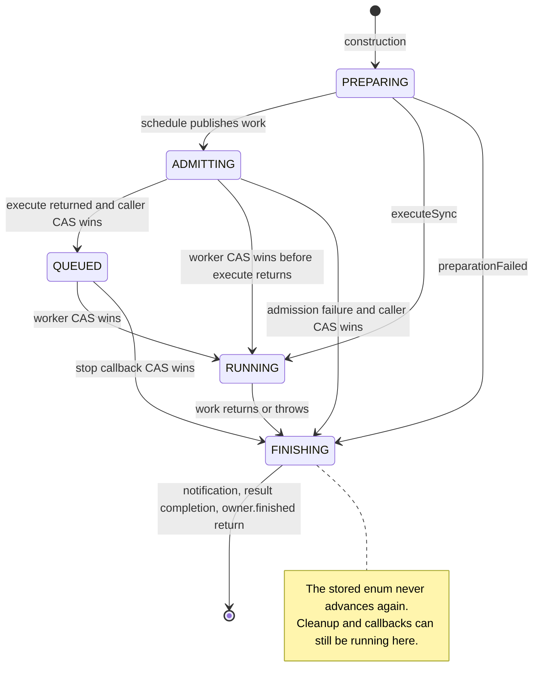
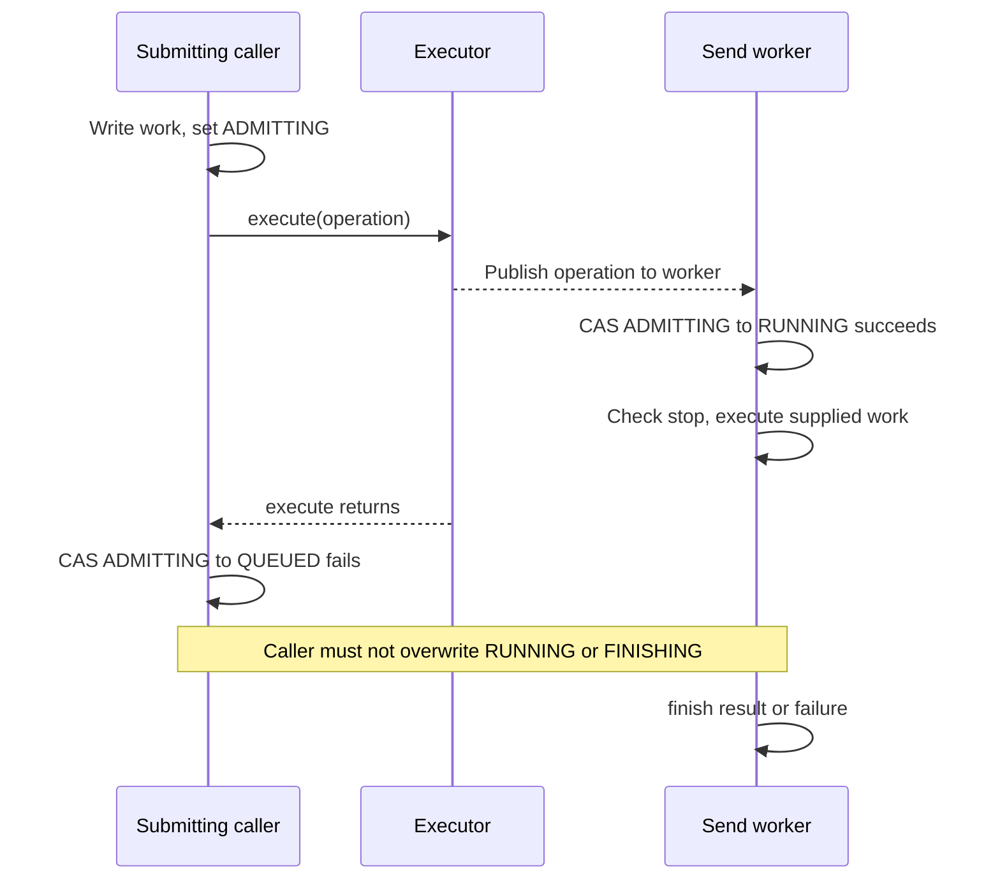
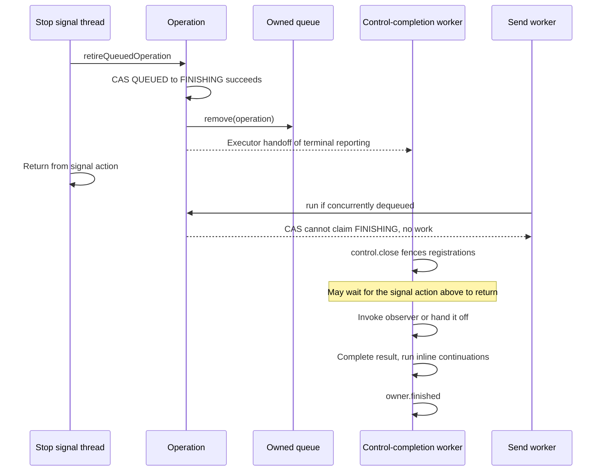

# One send operation

This keeps a send from being both started and cancelled out of its queue, and gives exactly one execution path responsibility for finishing it.

[Catalogue](README.md) · [Mailer lifecycle](02-mailer-lifecycle.md) · [Executor admission](03-executor-admission.md) · [Cross-machine contracts](08-cross-machine-contracts.md)

## Where to read the code

| Source | Entry points and responsibility |
| --- | --- |
| [MailSendOperation](../../modules/simple-java-mail/src/main/java/org/simplejavamail/mailer/internal/MailSendOperation.java) | `schedule`, `run`, `executeSync`, `preparationFailed`, `retireQueuedOperation`, `finish` own this machine. |
| [MailerImpl](../../modules/simple-java-mail/src/main/java/org/simplejavamail/mailer/internal/MailerImpl.java) | `beginEmailOperation`, `prepareMailSend`, `sendPreparedEmail`, and `sendMailsInSimpleBatch` decide what work belongs to the operation. |
| [MailSendAttempt](../../modules/simple-java-mail/src/main/java/org/simplejavamail/mailer/internal/MailSendAttempt.java) | `complete` constructs the per-email outcome and gates notification. |
| [MailSendObserverNotifier](../../modules/simple-java-mail/src/main/java/org/simplejavamail/mailer/internal/MailSendObserverNotifier.java) | `notifyCompletion` chooses inline invocation or application-executor handoff. |
| [MailSend](../../modules/core-module/src/main/java/org/simplejavamail/api/mailer/MailSend.java) | `getCompletion` exposes detached result views; `requestCancellation` signals work rather than cancelling a view. |

An ordinary email is prepared on its caller thread before asynchronous admission. The transport/proxy-owning `SendMailClosure` is constructed only inside `sendPreparedEmail`, after execution starts. A simple batch is one operation: it does not open its iterable during admission and produces separate per-email outcomes during execution. Open-connection opening and individual sends use separate operations inside a longer-lived [scope](02-mailer-lifecycle.md).

## States and transitions

These five names are the **actual private `State` enum**, held in an `AtomicReference`. `FINISHING` remains the stored value after completion; there is no `DONE` enum member. The final diagram marker means `finish()` has returned, not another enum value.

| Event / method | Guard and transition | Acting thread |
| --- | --- | --- |
| `schedule(action)` | Writes `work`, sets `ADMITTING`, checks stop, calls executor. | Submitting caller; admission may wait. |
| Executor invokes `run()` | CAS from `ADMITTING` **or** `QUEUED` to `RUNNING`; otherwise no work runs. | Executor thread; a caller-owned direct executor may use the submitting thread. |
| Executor returns without starting | CAS `ADMITTING → QUEUED`; if already stopped, immediately retry retirement. | Submitting caller. |
| Admission throws | Only CAS `ADMITTING → FINISHING` claims reporting. Runtime failures pass through control classification; an `Error` is rethrown. | Submitting caller. |
| `executeSync(action)` | Directly sets `RUNNING`; these internal entry points are not a reusable concurrent API. | Calling thread. |
| Preparation fails | `preparationFailed` directly sets `FINISHING`; no executor admission, sending lease or network connection has been entered. Capability validation can construct and close a probe transport. | Calling thread. |
| Cancellation/deadline signal | `retireQueuedOperation` only claims `QUEUED → FINISHING`; other states are untouched by this callback. | Cancellation caller, deadline watcher, or caller observing expiry. |
| Running work returns/throws | `finish` records `FINISHING` and owns terminal reporting. | Executing thread. |
| Retired queued work is reported | Owned queue removal is attempted first; terminal reporting is handed to the private completion executor. | Completion worker, not signal thread. |

A stop during `PREPARING` or `ADMITTING` is retained by the [control](04-stop-and-deadline-control.md). It does not prematurely finish preparation or race the scheduler into two completions. A worker checks the control before entering the supplied action; the submitting caller checks it again after successfully publishing `QUEUED`.

## Who protects what

| State | Protection / owner | Important boundary |
| --- | --- | --- |
| `state` | `AtomicReference<State>`; CAS arbitrates worker versus queued retirement. | No operation monitor and no `wait()` in this class. |
| `work` | Written before executor publication; consumed by the winning executing path; cleared by the finishing path. | The internal object is started once, not resubmitted or restarted by callers. |
| `completion` | `CompletableFuture` synchronization. | Calling `complete` may execute already-attached non-async continuations on the completing thread. |
| Attempt notification | `MailSendAttempt.completed.compareAndSet(false, true)`. | Prevents a second outcome if batch failure handling encounters an already-reported email. It does not make all attempt fields independently thread-safe. |
| Attempt timing/email fields | Caller preparation followed by executor publication, then single executing/finishing path. | They are not a mutable public concurrent model. |
| Cancellation/deadline resources | `MailSendControl` and each [registration](05-stop-registration.md). | `control.close()` may wait for an already-running resource action; it runs before notifying the application. |
| Current-operation context | Owner's `CURRENT_OPERATION` `ThreadLocal`. | Marks execution and terminal reporting, restores prior context in `finally`; not a lock or thread handoff. |

`finish()` itself does not acquire the owner monitor while waiting for registrations or invoking observers. It enters `owner.finished()` only after future completion returns. The lock relationships inside control closure are documented separately.

## Race: execution starts before scheduling returns

This is why `ADMITTING` cannot be collapsed into “not yet running.” An executor can consume work before `execute()` returns, including before the caller obtains its public handle.

## Race: cancelling work that has not started

For a caller-owned executor, SJM does not remove arbitrary queue entries. The wrapper can remain in that executor, but the failed CAS makes later execution inert. If the worker wins the `QUEUED → RUNNING` CAS instead, cancellation follows the running [pool/transport](06-pool-claims-and-leases.md) boundaries; it is not queued retirement anymore.

## Terminal order and application code

For an ordinary send, the order is:

1. Supplied work exits, including its transport/lease/proxy cleanup.
2. Set `FINISHING`, discard `work`, close/fence the control's registrations.
3. Notify success/failure through the per-email attempt.
4. Complete the private future, potentially executing non-async continuation chains.
5. Call `owner.finished()`; restore the prior `ThreadLocal` marker when the surrounding helper returns.

Observer behavior is deliberately separate from result ownership:

| Configuration | What must finish before result completion / drain bookkeeping |
| --- | --- |
| No observer | No notification work. |
| Inline observer | Callback returns; its `RuntimeException` is logged and ignored. |
| Application executor | `execute(notification)` returns; the callback may not have started. Runtime handoff rejection is logged; there is no inline fallback or second send failure. |
| Direct executor such as `Runnable::run` | Actually runs inline, despite using the executor overload. |

The outcome's completion timestamp is captured **before** notification. On an ordinary send's normal cleanup path, a healthy pooled lease has been returned for reuse, invalidated disposal has settled, or a directly owned transport has been closed; healthy release is not physical disposal. For a batch, each email notifies while its shared transport remains in scope; its ongoing control pauses the deadline around inline callback / handoff time. Those per-email notifications precede the batch operation's eventual `finish()`. Do not apply the ordinary-send resource-retirement ordering to shared scopes. See [pool cleanup boundaries](06-pool-claims-and-leases.md) for exceptional release paths.

Cancellation is a request, not a final state or proof of non-delivery. This machine does not classify SMTP acceptance or retry safety. A late stop can coexist with an accepted receipt; classification belongs to the [cross-machine result contract](08-cross-machine-contracts.md).

## Tests and limits of their evidence

| Test source / method | What the assertions establish |
| --- | --- |
| [MailSendOperationTest](../../modules/simple-java-mail/src/test/java/org/simplejavamail/mailer/internal/MailSendOperationTest.java) — `queuedCancellationReclaimsCapacityBeforeInvokingItsObserver` | Holds the only worker, cancels queued work, checks empty owned queue inside the observer, checks completion-worker identity, admits replacement work, and proves the cancelled action did not run. |
| Same — `callerExecutorWrapperNeverRunsAfterCancellationEvenWhenItCannotBeRemoved` | Leaves cancelled work in an application executor, drains SJM bookkeeping without shutting that executor down, then proves later dequeue does not run the action. |
| Same — `admissionUsesTheRemainingDeadlineAndReportsOnTheSubmittingThread` | Saturates direct handoff, expires the send budget, checks timeout and caller-thread notification, and asserts the action never executes. |
| [MailSendObserverDispatchTest](../../modules/simple-java-mail/src/test/java/org/simplejavamail/mailer/MailSendObserverDispatchTest.java) — `outcomeIsHandedOffBeforeCompletionWithoutWaitingForItsApplicationExecutor` | Collects rather than executes notifications, completes and closes the Mailer, then invokes the saved callback and checks the exact receipt. |
| Same — `rejectedHandoffDoesNotReplaceSuccessfulOrFailedSends`, `directExecutorRunsInlineAndCallbackRuntimeExceptionsRemainIsolated` | Checks rejected handoff and callback runtime failures do not replace send outcomes; verifies direct invocation across repeated sends. |
| [MailSendTest](../../modules/core-module/src/test/java/org/simplejavamail/api/mailer/MailSendTest.java) — `completionViewsCannotCompleteOrCancelTheOperation`, `cancellationIsAOneShotRequestAndDoesNotResolveTheResult` | Mutating a detached view leaves real work/result untouched; requesting cancellation does not itself settle completion. |

These tests exercise controlled examples, not every CAS interleaving. There is no dedicated barrier-controlled test here forcing the worker to win during `ADMITTING`; that edge is documented from `schedule()` and `run()`. An arbitrary non-cooperative executor or application action can delay completion indefinitely. These diagrams are a map for reviewing those boundaries, not a deadlock proof.
