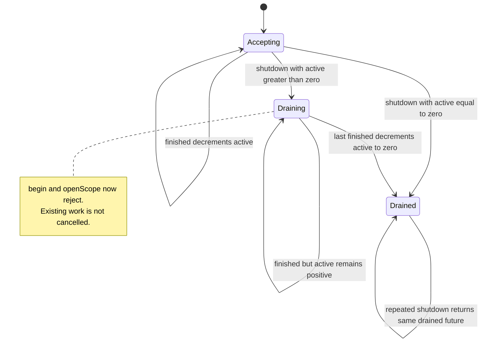
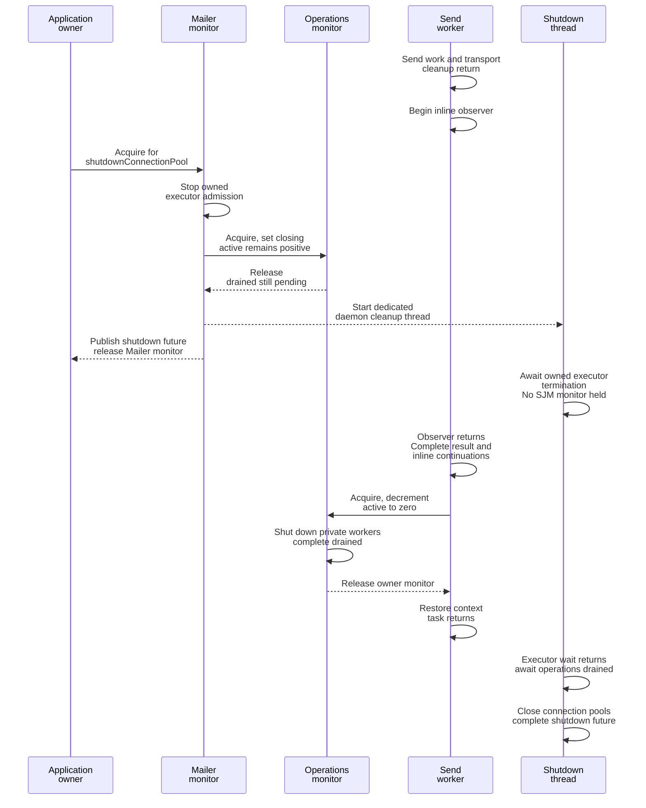
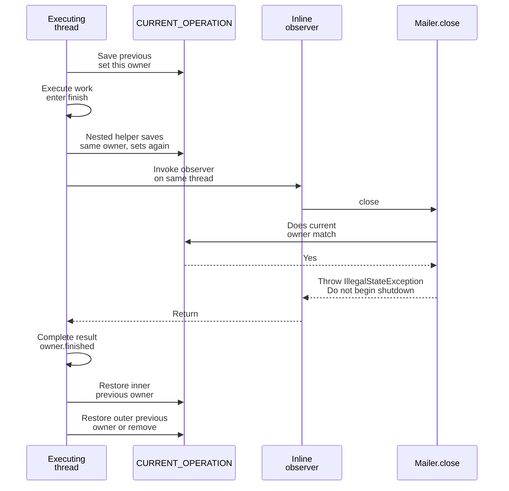

# Mailer operation lifetime and graceful shutdown

This lets shutdown wait for the work the Mailer still owns without making a send worker wait for itself.

[Catalogue](README.md) · [Send operation](01-send-operation.md) · [Executor admission](03-executor-admission.md) · [Cross-machine contracts](08-cross-machine-contracts.md)

## Where to read the code

| Source | Relevant methods |
| --- | --- |
| [MailSendOperations](../../modules/simple-java-mail/src/main/java/org/simplejavamail/mailer/internal/MailSendOperations.java) | `begin`, `openScope`, `withinOperation`, `finished`, `shutdown`, `finishShutdownIfDrained`, `completeUnstarted`. |
| [MailerImpl](../../modules/simple-java-mail/src/main/java/org/simplejavamail/mailer/internal/MailerImpl.java) | `withOpenConnection`, `shutdownConnectionPool`, `drainExecutorAndCloseConnectionPools`, `close`. |
| [SendMailsWithOpenConnectionClosure](../../modules/simple-java-mail/src/main/java/org/simplejavamail/mailer/internal/SendMailsWithOpenConnectionClosure.java) | `runOpenConnectionCallback`, `openSmtpTransport`, `sendMailAndGetReceipt`, `closeTransportIfOpened`. |
| [MailSendOperation](../../modules/simple-java-mail/src/main/java/org/simplejavamail/mailer/internal/MailSendOperation.java) | `executeWork` and `finish` install context and release lifetime bookkeeping. |

`MailSendOperations` owns two lazily started daemon workers: one scheduled deadline worker (`sjm-deadline-*`) and one serial terminal-reporting worker (`sjm-control-completion-*`). Normal sends use the configured send executor, not either of these workers. The separate terminal worker handles sends retired before execution so a slow observer cannot occupy the deadline watcher.

## States are derived, not an enum

The implementation uses `closing`, `active`, and `drained`; the following names are conceptual combinations of those fields. “Drained” means operation bookkeeping has finished and the private workers have been told to shut down. It does **not** mean both threads have already terminated.

| Event | Guard / state change | Acting thread |
| --- | --- | --- |
| `begin(success, failure)` | Under owner monitor, reject if `closing`; construct operation/control, then `active++`. | Send caller, or open-connection caller. |
| `openScope()` | Under owner monitor, reject if `closing`; `active++`. | `withOpenConnection` caller. |
| `finished()` | Under owner monitor, `active--`; if `closing && active == 0`, initiate private-worker shutdown and complete `drained`. | Completing send thread, private completion worker, or scope owner. |
| `shutdown()` | Under owner monitor, set `closing = true`; perform the same zero-active check. | Shutdown initiator and dedicated shutdown thread. |
| `Scope.close()` | A scope-local `closed` flag prevents sequential double release, then calls `finished`. | Thread leaving the lexical open-connection scope. |
| `MailerImpl.shutdownConnectionPool()` | Under Mailer monitor, reuse `shutdownFuture` if present; otherwise stop owned executor admission, close operation admission, start dedicated cleanup thread. | Any caller, including one initiating shutdown without blocking. |
| `MailerImpl.close()` | Reject self-wait when current-operation or owned-worker marker matches; otherwise wait on the shutdown future. | Owning application thread. |

## Lock and ownership map

| Mechanism | Protects / owns | Nesting and waiting rules |
| --- | --- | --- |
| `synchronized (MailSendOperations)` | `active`, `closing`, and the decision to complete `drained`. | `begin` constructs a control under this monitor, acquiring that new control's monitor. No send I/O or observer is invoked here. |
| `synchronized (MailerImpl)` | Publication and reuse of `shutdownFuture`. | `shutdownConnectionPool` calls executor shutdown and then owner shutdown while holding this monitor; it does not wait for sends there. |
| `CURRENT_OPERATION` | Per-thread innermost Mailer-operation owner, including terminal notification/completion. | No lock. Save previous value, install current owner, run immediately, restore/remove in `finally`. |
| Executor `CURRENT_WORKER` | Identity of the SJM-owned executor whose task is on this thread. | Set in `beforeExecute`, removed in `afterExecute`; covers non-send tasks too. |
| `Scope.closed` | One lexical open-connection scope's release-once state. | Plain boolean, not a concurrent close protocol; the scope is used on its owning call stack. |
| `SEQUENCE` | Names private worker pairs uniquely. | `AtomicInteger`; no lifecycle authority. |

The owner has no `wait()`/`notify()` loop. The dedicated shutdown thread waits on executor termination and futures **after leaving** both the Mailer and owner monitors. The owner calls `drained.complete(null)` while holding its monitor; in production this is an internal coordination future, not the user's send future. New dependent callbacks on that internal future would need their own lock/callback review.

The currently used nesting direction is Mailer monitor → owner monitor; operation construction can nest owner monitor → new control monitor. Normal `finish()` closes the control and invokes application code before entering `owner.finished()`, so it does not hold the owner monitor while fencing stop actions or calling observers.

## Race: shutdown begins while a send is still reporting

If the send uses a caller-owned executor, shutdown skips executor termination entirely, but still waits for SJM's accepted operations. Already cancelled wrappers can remain queued in that external executor without retaining active SJM work. SJM never shuts down that executor or an observer executor.

Accepted sends are drained, not cancelled. A queued/admitting operation has its own [stop/deadline rules](04-stop-and-deadline-control.md). The asynchronous shutdown future represents pool closure as well as send drain; a send result alone does not.

## Why `withinOperation` is a context marker

The marker also surrounds synchronous sends, sends running on caller executors, private queued-completion work, and the full open-connection callback. Nested calls do not simply clear the marker: restoring the prior value preserves the surrounding operation after nested work returns or throws.

This is a local self-wait guard, not a general dependency-graph detector. It retains the innermost owner, not every owner in a cross-Mailer call chain. The owned-worker check catches some additional cases, but cannot generally detect cycles between multiple Mailers, application locks or futures. Calling `shutdownConnectionPool().get()` explicitly from one's own callback also bypasses the convenience `close()` guard; initiating shutdown and waiting for it are different actions.

## What counts as active

| Work | Lifetime counted by `active` |
| --- | --- |
| Ordinary synchronous/asynchronous send | From successful `begin`, through preparation/admission/execution, cleanup, inline observer or handoff, and private future completion. |
| Simple batch | One operation for the complete batch; per-email observers execute within it. |
| Open connection | One scope for opening, callback gaps, per-email sends and final transport/proxy cleanup; opening and each email also register nested operations. |
| A queued send retired by cancellation | Remains active until terminal reporting finishes on the private completion worker. |
| Observer accepted by an external executor | Only the handoff is counted; its later application work is not. A direct executor runs within the counted handoff. |
| Non-async future continuations | Those executed by the finishing thread can delay `complete(...)` returning and therefore delay `finished()`. Independent async continuations are not joined. |
| Connection-test tasks | Not `MailSendOperation`s; an owned executor's termination wait accounts for accepted executor tasks. Caller-owned executor tasks do not gain send-lifetime tracking from this mechanism. |

Open-connection scope accounting is separate from deadlines: application gaps and final scope cleanup have no send deadline, while opening and each email have their own control. Keeping `active > 0` through those gaps prevents pool shutdown from racing the still-open scope. The callback's `MailSender` is a scoped, sequential helper, not a concurrent shared transport.

## Tests and boundaries

| Test source / method | Evidence |
| --- | --- |
| [MailSendOperationTest](../../modules/simple-java-mail/src/test/java/org/simplejavamail/mailer/internal/MailSendOperationTest.java) — `inlineObserverTimeIsNotPartOfTheSendDeadlineAndShutdownWaitsForIt` | Holds an inline observer, asserts current-operation identity, proves drain remains pending beyond the send timeout, then releases the observer and observes completion/drain. |
| Same — `slowTerminalObserverCannotBlockOtherDeadlineSignals` | Blocks the serial completion worker in one observer; another operation's deadline signal arrives while both result futures remain pending. |
| Same — `callerExecutorWrapperNeverRunsAfterCancellationEvenWhenItCannotBeRemoved` | SJM drain completes without shutting down the caller executor; its later cancelled wrapper does no work. |
| [MailSendQueueTest](../../modules/simple-java-mail/src/test/java/org/simplejavamail/mailer/MailSendQueueTest.java) — `closeFromAnObserverCannotDeadlockItsOwnWorker` | Callback receives `IllegalStateException`; send completes and executor remains open until its external owner closes it. |
| Same — `shutdownStopsAdmissionAndDrainsAcceptedWorkBeforeClosingPools` | Holds a running send with one queued, verifies shutdown future identity and post-close rejection, then proves both accepted sends complete before shutdown returns. This fixture uses a custom transport; it does not independently observe a live pool-close event. |
| [MailSendObserverDispatchTest](../../modules/simple-java-mail/src/test/java/org/simplejavamail/mailer/MailSendObserverDispatchTest.java) — `outcomeIsHandedOffBeforeCompletionWithoutWaitingForItsApplicationExecutor` | Mailer closes while its handed-off notification is still saved but unexecuted. |
| [MailSendExecutionControlTest](../../modules/simple-java-mail/src/test/java/org/simplejavamail/mailer/MailSendExecutionControlTest.java) — `openConnectionGetsFreshPerEmailBudgetsAndDoesNotTimeApplicationGaps` | Two successful sends share one connection despite a callback gap longer than the per-email timeout. |

There is no dedicated test in these files for restoring `CURRENT_OPERATION` after a nested different-Mailer call throws, nor a barrier-controlled shutdown race spanning an open-connection application gap. The ownership descriptions above come from the relevant `finally` and scope paths, not those tests.

Graceful shutdown has no imposed overall timeout here. A blocked inline observer, non-async continuation, scope callback, non-cooperative application action or executor can keep it pending. The single completion worker serializes queued terminal reports; an application needing independent/buffered observer work must supply its own executor and own its drain policy. Drawing the lifecycle does not establish that arbitrary application wait graphs are safe.
