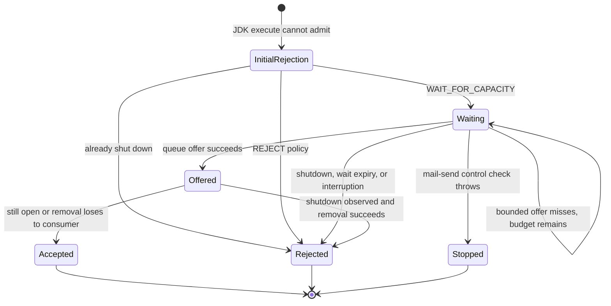
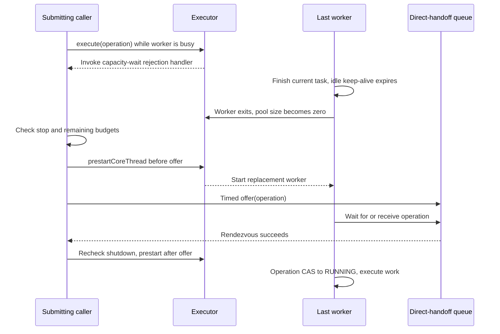
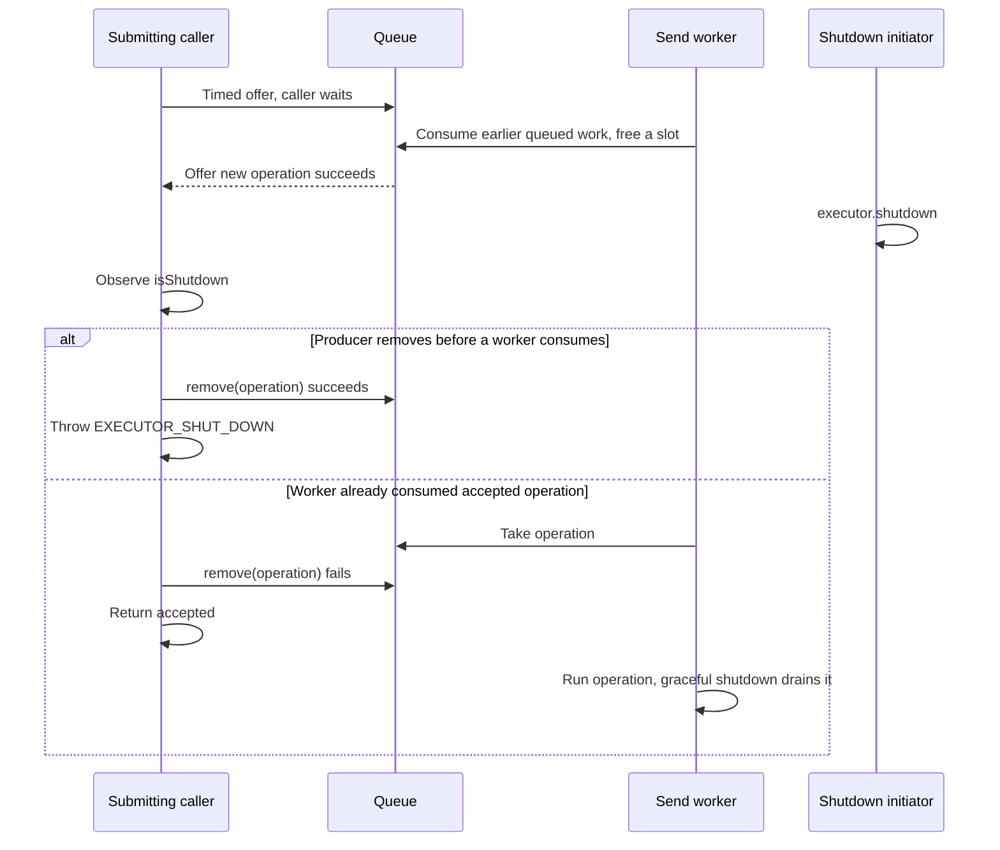

# Executor admission and worker availability

This bounds waiting work without quietly running SMTP on the submitting thread when the queue is full.

[Catalogue](README.md) · [Send operation](01-send-operation.md) · [Mailer lifecycle](02-mailer-lifecycle.md) · [Stop/deadline control](04-stop-and-deadline-control.md)

## Where to read the code

| Source | Relevant methods |
| --- | --- |
| [MailSendExecutor](../../modules/simple-java-mail/src/main/java/org/simplejavamail/mailer/internal/MailSendExecutor.java) | Constructor, `waitForCapacityOrReject`, `enqueueBeforeTimeout`, `beforeExecute`, `afterExecute`, `snapshot`. |
| [MailSendOperation](../../modules/simple-java-mail/src/main/java/org/simplejavamail/mailer/internal/MailSendOperation.java) | `schedule` distinguishes admission failure from accepted work; `run` arbitrates execution. |
| [MailSendOperations](../../modules/simple-java-mail/src/main/java/org/simplejavamail/mailer/internal/MailSendOperations.java) | `completeUnstarted` removes retired work from this owned queue before terminal reporting. |
| [AsyncQueueConfig](../../modules/core-module/src/main/java/org/simplejavamail/api/mailer/config/AsyncQueueConfig.java) | Resolved capacity, overflow policy, wait timeout. |
| [AsyncQueueRejectionReason](../../modules/core-module/src/main/java/org/simplejavamail/api/mailer/AsyncQueueRejectionReason.java) | Queue full, executor shutdown, wait timeout, wait interruption. |

The normal `ThreadPoolExecutor.execute` path attempts admission first. SJM's handler runs only when that path rejects. `WAIT_FOR_CAPACITY` waits for admission, not send completion. It may therefore delay return from an asynchronous API, but it never invokes the SMTP action as a caller-runs fallback.

This policy belongs to SJM's executor. A caller-provided executor retains its own scheduling, rejection and ownership rules, including any caller-runs policy it supplies.

## Queue shapes and conceptual states

| Configured capacity | Concrete queue | Meaning |
| --- | --- | --- |
| `-1` | `LinkedBlockingQueue` | No configured waiting-capacity bound. |
| `0` | Fair `SynchronousQueue` | Direct rendezvous with a worker; stores no waiting task. |
| Positive | Fair `ArrayBlockingQueue` | That many waiting tasks; running workers are additional. |

Worker core and maximum counts both equal the configured worker limit. A positive keep-alive enables core worker expiry. Consequently even an executor that is not shut down can temporarily have zero live workers.

There is **no SJM admission-state enum**. This diagram describes one call through the rejection handler; it is separate from the actual `MailSendOperation.State` and JDK executor lifecycle.

| Event / guard | Effect | Acting thread |
| --- | --- | --- |
| Initial handler sees shutdown | Throw `EXECUTOR_SHUT_DOWN`; increment that counter. | Submitting caller. |
| Policy is `REJECT` | Throw `QUEUE_FULL`; increment that counter. | Submitting caller. |
| Start a capacity wait | Compute monotonic admission deadline from `waitTimeoutMillis`. | Submitting caller. |
| Poll a `MailSendOperation` | `checkStopped`; cap this offer by remaining send budget. | Submitting caller; may synchronously discover expired deadline. |
| Before each timed offer | `prestartCoreThread` ensures a possible direct-handoff consumer. | Submitting caller requests worker creation; worker runs separately. |
| Offer waits | Wait at most the smaller of current remaining budget and 50 ms. | Caller waits inside queue implementation, not holding an SJM control/owner monitor. |
| Offer succeeds | If now shut down and `remove(operation)` succeeds, reject; otherwise prestart again and return accepted. | Submitting caller, racing a worker or shutdown initiator. |
| Offer misses | Recompute remaining admission time; retry while time remains and executor is open. | Submitting caller. |
| Java thread interruption | Timed queue offer throws; restore interrupt flag and throw `CAPACITY_WAIT_INTERRUPTED`. | Interrupted submitting caller. This is an actual Java interrupt, unlike ordinary cancellation signals. |
| Wait loop ends | Check send control once more; otherwise report shutdown or capacity timeout. | Submitting caller. |

A send timeout is not counted as a queue rejection: the control throws its own timeout/cancellation failure rather than calling `reject`. Which event wins a tight boundary race follows the checks shown here; the counters are not a total census of all failed sends.

## Synchronization ownership

| Mechanism | Protected state | What SJM does with it |
| --- | --- | --- |
| `ThreadPoolExecutor` internals | Worker population, execution and shutdown. | Uses `execute`, `prestartCoreThread`, `remove`, `shutdown`, and lifecycle hooks; does not acquire its private locks directly. |
| `BlockingQueue` internals | Queue slots or synchronous producer/consumer rendezvous. | Timed `offer` waits for capacity; no SJM intrinsic monitor surrounds the wait. |
| `AtomicLongArray rejections` | One counter per `AsyncQueueRejectionReason.ordinal()`. | Increments only when `reject(reason)` constructs a queue rejection. |
| `CURRENT_WORKER` `ThreadLocal` | Current SJM executor identity on that worker thread. | Set before task execution, removed afterwards; used by `Mailer.close` to detect self-wait. |
| Two `AtomicInteger` sequences | Executor/thread names. | Identification only, not admission or lifecycle state. |
| Immutable `AsyncQueueConfig` | Capacity/policy/wait settings. | No runtime configuration lock. |
| Per-operation control monitor | Remaining deadline and stop signal. | Each getter/check releases its monitor before `prestartCoreThread` or queue `offer`. |

There is no `synchronized` block or explicit `wait()/notify()` in `MailSendExecutor`. JDK queues/executor provide their own coordination; this page does not assign portable lock identities to those implementation details. `snapshot()` reads queue size, active count, shutdown and counters separately, so it is a detached diagnostic sample, not one atomic admission snapshot.

## Race: the last worker expires after initial rejection

The pre-offer start is essential for capacity zero: an offer cannot succeed without a consumer. The post-offer start remains necessary for a buffered queue because the worker can expire between the first prestart and successful insertion. Repeating the prestart on every poll covers expiry between polls as well. The producer does not wait for work to execute.

## Race: shutdown happens while a capacity waiter succeeds

If no offer succeeds, 50 ms polling gives the caller another chance to see shutdown instead of waiting the entire configured admission timeout. This is a polling bound, not a hard real-time promise: scheduling delays and the queue/runtime still determine when the caller actually resumes.

## Invariants and boundaries

- Queue capacity excludes running workers. Capacity zero means “no stored waiting work,” not “no concurrency.”
- Admission owns no transport/proxy resources; ordinary send closure construction is deferred until execution.
- Successful handoff means accepted work may already be running; shutdown must not turn a consumed task into an unrelated rejection.
- Cancelling an accepted queued operation uses its state CAS before queue removal; a dequeue race cannot execute a retired wrapper.
- The rejected call does not perform SMTP itself. Synchronous mail APIs still run on their callers as designed.
- A capacity wait timeout and a total send timeout have different causes and exception types. Both budgets are consulted for a mail-send operation.
- Graceful shutdown keeps accepted work; it does not call `shutdownNow()` as a cancellation strategy.
- There is no general solution here for an inline observer submitting another async send to its own saturated executor and then waiting for it. Application-level dependency cycles can still consume all workers; the shutdown self-wait guard does not detect those cycles.

## Tests and the interleavings they establish

| Test source / method | Evidence |
| --- | --- |
| [MailSendExecutorTest](../../modules/simple-java-mail/src/test/java/org/simplejavamail/mailer/internal/MailSendExecutorTest.java) — `waitingAdmissionRestartsWorkersThatExpiredAfterRejection` | Wraps the rejection handler, releases the busy worker, waits for actual pool size zero, then resumes admission. Capacities zero and one both execute once on a non-caller thread without a rejection count. |
| Same — `anIdleExecutorRestartsAfterItsLastWorkerExpires` | Repeats send/complete/confirmed-worker-expiry twenty times. |
| Same — `shutdownReleasesAnAdmissionWaiterAndDoesNotDiscardAcceptedWork` | Confirms the producer is timed-waiting before shutdown, checks prompt shutdown rejection and completion of previously queued work, for capacities zero and one. |
| Same — `concurrentProducersCannotOversubscribeTheWaitingQueue` | Holds two workers, races 24 producers for five queue slots, checks exactly five accepted and 19 queue-full rejections, then verifies those five execute. |
| Same — `capacityExcludesActiveWorkers` | Saturates three workers and separately fills configured waiting slots for capacities zero, one and four. |
| [MailSendQueueTest](../../modules/simple-java-mail/src/test/java/org/simplejavamail/mailer/MailSendQueueTest.java) — `boundedWaitAdmitsAfterCapacityIsFreedWithoutRunningOnTheSubmittingThread` | Releases a held custom transport, observes all submitted emails, and checks the admission caller did not execute transport work. |
| Same — `zeroCapacityRejectsWhileBusyAndBoundedWaitingCanTimeOutOrBeInterrupted` | Checks capacity timeout plus interrupt rejection and preserved caller interrupt flag. |
| Same — `rejectionIsObservedOnCallerAndDoesNotOpenBatchOrConnectionTestResources` | Checks caller-thread outcome, no started timestamp/receipt, untouched rejected batch iterable, and no rejected connection-test invocation. |
| [MailSendOperationTest](../../modules/simple-java-mail/src/test/java/org/simplejavamail/mailer/internal/MailSendOperationTest.java) — `admissionUsesTheRemainingDeadlineAndReportsOnTheSubmittingThread` | Uses a send deadline shorter than capacity wait, checks timeout/caller notification and zero execution of expired work. |

The shutdown tests cover a waiting producer, not a deterministic barrier at the exact post-offer `remove` race drawn above. Worker-expiry coverage forces expiry before the handler resumes, not every possible expiry between consecutive polls. Keep those distinctions when expanding regression coverage; neither repeated tests nor a state diagram enumerate every scheduler interleaving.
