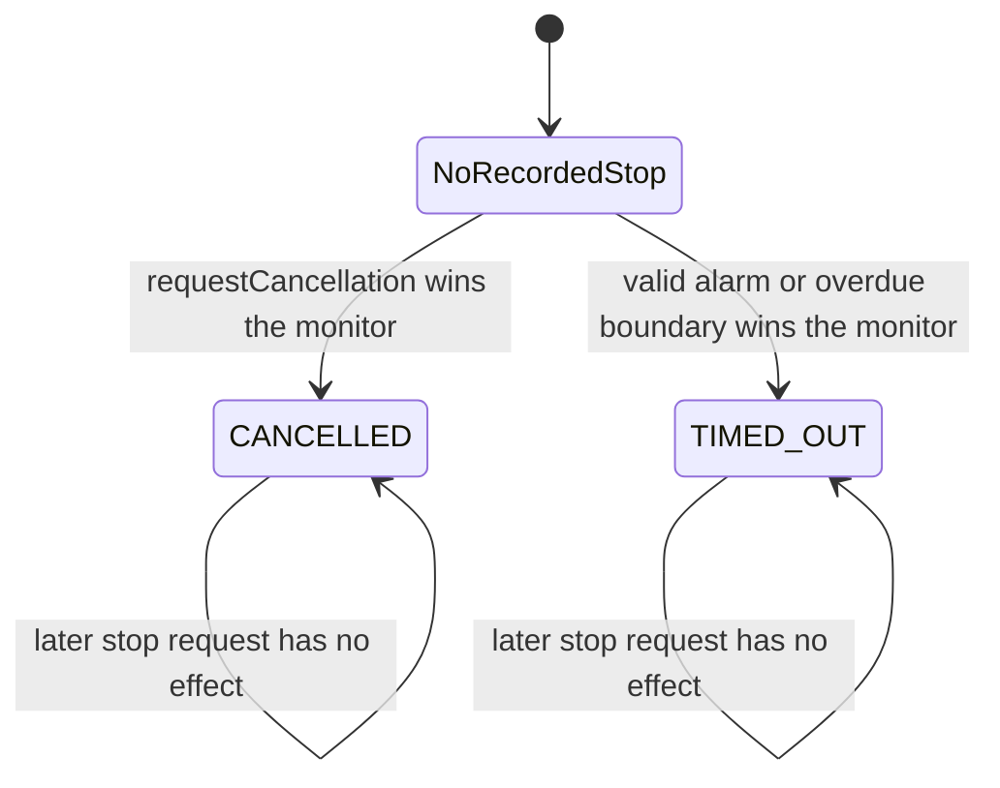
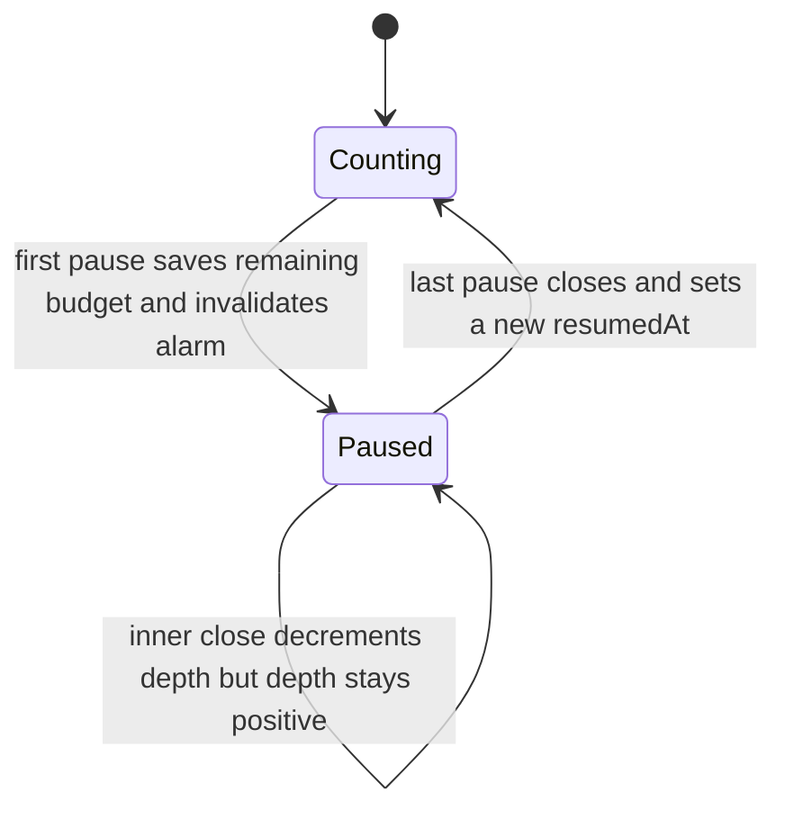
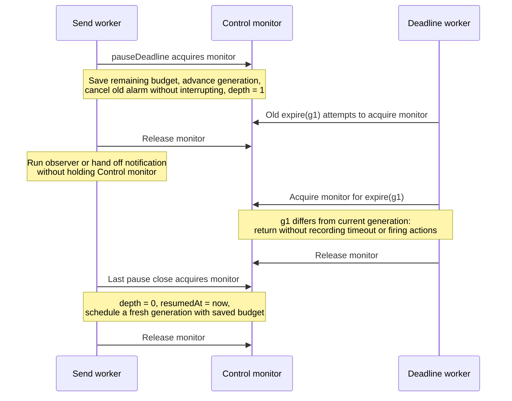

# Stop and deadline control

This control lets queue, pool and transport code react to the same cancellation request or time budget without making the timer thread finish the email send.

[Catalogue](README.md) · [Send operation](01-send-operation.md) · [Stop registrations](05-stop-registration.md)

## Where it sits

[MailSendControl](../../modules/core-module/src/main/java/org/simplejavamail/internal/util/concurrent/MailSendControl.java) owns the stop reason, remaining send budget and resource registrations. [MailSendOperations.begin](../../modules/simple-java-mail/src/main/java/org/simplejavamail/mailer/internal/MailSendOperations.java) constructs it before preparation or queue admission, using the Mailer's single deadline scheduler. Construction initializes all budget fields, then schedules the first alarm under the control's monitor. The alarm can become runnable before construction returns; its `expire` method must acquire that same monitor before inspecting state.

A control is not the result of a send. Requesting a stop does not complete a future, invoke an observer, establish an SMTP outcome or interrupt a Java thread. It invokes short internal actions that retire queued work, cancel a pool claim or abort a transport. The [send operation](01-send-operation.md) completes only after its execution and cleanup path finishes.

The scope depends on the entry point:

| Entry point | Budget scope |
|---|---|
| Ordinary synchronous or asynchronous send | One control starts before preparation and covers admission, execution and cleanup until `MailSendOperation.finish` closes it. |
| Simple batch | One control covers the whole batch, including lazy iteration and preparation. Observer notification between emails temporarily pauses its deadline. |
| `withOpenConnection` | Connection opening has its own control; each email has a fresh control. Application gaps and final scope cleanup have no send deadline. |

Sources: [MailerImpl.prepareMailSend / sendMailsInSimpleBatch](../../modules/simple-java-mail/src/main/java/org/simplejavamail/mailer/internal/MailerImpl.java), [SendMailsInSimpleBatchClosure](../../modules/simple-java-mail/src/main/java/org/simplejavamail/mailer/internal/SendMailsInSimpleBatchClosure.java), [SendMailsWithOpenConnectionClosure.openSmtpTransport / sendMailAndGetReceipt](../../modules/simple-java-mail/src/main/java/org/simplejavamail/mailer/internal/SendMailsWithOpenConnectionClosure.java).

## State is split deliberately

Only `StopReason` is an enum. Treating everything below as a single enum would hide combinations that really occur—for example, a timed-out control can be paused during failure notification and then closed.

| Independent part | Actual representation | Meaning |
|---|---|---|
| Stop reason | Nullable `StopReason`: `CANCELLED` or `TIMED_OUT` | The first recorded stop request wins. `null` means no stop has been recorded, not necessarily that time remains. |
| Lifetime | `finished` | `close()` has started retiring the control. It does not itself prove that all in-flight actions have finished. |
| Deadline mode | Final `timed` | Whether a total deadline was configured. Untimed sends can still be cancelled. |
| Budget | `remainingNanos`, `resumedAt`, `deadlinePauses` | Stored budget minus monotonic elapsed time while unpaused; a nesting count suspends that accounting. |
| Alarm identity | `alarmGeneration`, `alarm` | Identifies the currently valid scheduled callback, independently of whether an old callback is already running. |
| Failure classification | `failureRecorded`, nullable `stopAtFailure` | Freezes the stop reason at the first `translateFailure` call, including the absence of a stop. |

The stop-reason machine, while the control remains open:

Closing disarms the alarm and rejects further stop requests; it does not clear the recorded reason. An already accepted SMTP result can therefore coexist with a late stop recorded during connection cleanup. [TransportRunner.closeAfterSend](../../modules/simple-java-mail/src/main/java/org/simplejavamail/mailer/internal/util/TransportRunner.java) preserves observed acceptance when a subsequent stop causes cleanup to fail. Do not infer a submission status from this diagram.

The following is a **derived budget view**, not another enum. It shows pause accounting for a timed control; stopping or closing prevents further alarms from being scheduled.

Pausing does not disable cancellation. If the budget was already exhausted when the outer pause began, `pauseDeadline()` still records a timeout after leaving the monitor. `DeadlinePause.close()` is idempotent for its normal, thread-confined try-with-resources use; the pause object itself is not a cross-thread coordination primitive.

## Transitions and executing threads

All references below are methods of `MailSendControl` unless named otherwise.

| Event / method | Guard and state change | Executing thread and work outside the monitor |
|---|---|---|
| Constructor → `scheduleAlarm` | Schedule only when timed, open, unpaused and unstopped; increment generation. | Caller starting the operation. The scheduler invokes `expire` later. |
| `requestCancellation` → `requestStop` | If open and no reason exists: record cancellation, invalidate/cancel alarm and snapshot registrations. | Requesting thread; fires the snapshot after releasing the monitor. |
| `checkStopped` | If elapsed budget is zero, request timeout; throw if any stop is recorded. | Preparation caller, admission caller or send worker. Does not depend on the watcher having run. |
| `expire(generation)` | Ignore stale generation, closed, paused or stopped control. If early, save remaining budget and reschedule; otherwise record timeout and snapshot registrations. | Deadline worker; fires the snapshot outside the monitor. |
| `translateFailure` | First check overdue time, then freeze `stopAtFailure` once. | Thread reporting a preparation, admission, claim or transport failure, before later cleanup can relabel it. |
| `pauseDeadline` | Save remaining budget and cancel alarm only at depth zero; increment depth. | Thread entering observer notification/handoff. An already-expired budget requests timeout outside the monitor. |
| `DeadlinePause.close` → `resumeDeadline` | Decrement depth. Only transition to zero resets `resumedAt` and attempts scheduling. | Thread leaving that notification/handoff scope. |
| `close` | Set `finished`, invalidate/cancel alarm and snapshot registrations. Repeated calls return immediately. | Finishing thread; closes each registration outside the monitor, waiting for another thread's running action when necessary. |

`remainingNanos()` returns `Long.MAX_VALUE` for an untimed or paused deadline. Otherwise it subtracts elapsed `System.nanoTime()` from the saved budget and clamps at zero. This is elapsed-duration accounting, not wall-clock timestamp accounting; `MailSendOutcome` timestamps are a separate concern.

The first failure snapshot is not a saved throwable. A later `translateFailure` can return a later contextual wrapper unchanged when `stopAtFailure` was `null`. When a stop was already recorded, it wraps the supplied failure in the corresponding stop exception, retaining the exact receipt if that supplied failure is a `MailSubmissionException`. Existing cancellation/timeout exceptions pass through unchanged.

## Why alarm generations matter

Cancelling a scheduled future with `cancel(false)` does not interrupt a callback that has already started. A generation comparison prevents that old callback from consuming a resumed budget.

The same stale-generation check works if the old callback only obtains the monitor after the pause has already resumed. Rechecking elapsed time at send boundaries covers the opposite problem: an alarm that has not run yet because the scheduler is busy.

The only production pause call site is [MailSendAttempt.complete](../../modules/simple-java-mail/src/main/java/org/simplejavamail/mailer/internal/MailSendAttempt.java). It surrounds [MailSendObserverNotifier.notifyCompletion](../../modules/simple-java-mail/src/main/java/org/simplejavamail/mailer/internal/MailSendObserverNotifier.java): the inline callback, or `Executor.execute` when an application executor is supplied. Work that executor runs later is not awaited. A direct executor executes inside this pause. Ordinary sends have already closed their control before terminal notification; pausing matters especially between emails in a simple batch, whose shared control remains open.

## Lock ownership and dependencies

| Lock / mechanism | Protects | Nesting and restrictions |
|---|---|---|
| `synchronized (MailSendControl.this)` | `stopReason`, `stopAtFailure`, `failureRecorded`, registration-list membership, `alarm`, `remainingNanos`, `resumedAt`, `alarmGeneration`, `deadlinePauses`, `finished` | Reentrant calls such as `pauseDeadline` → `remainingNanos` use the same monitor. Scheduling/cancelling the scheduler future happens inside it. No registration action or registration wait happens inside it. |
| Each `Registration` monitor | That registration's `closed` and `executingThread` | Its monitor is released before the action runs and before `close` acquires the control monitor to remove membership. See [registration fencing](05-stop-registration.md). |
| Final fields | `watcher`, `timed`; each registration's `action` | No mutation after construction. A registration returned after the control finished is marked closed before being shared. |
| `DeadlinePause.closed` | Whether this lexical pause scope has already resumed | Plain field, confined to its owning scope; not protected by a monitor. |

There is no atomic or `ThreadLocal` state in this class. The operation marker in [Mailer lifecycle](02-mailer-lifecycle.md) is a separate mechanism. `MailSendOperations.begin` holds the owner's monitor while constructing the control, but control actions do not run with the control monitor held. Review an added call under either monitor for a new reverse lock dependency rather than assuming every synchronized method is independent.

These are the production consumers of the control's boundary API:

| Consumer | Boundary checks / registered action |
|---|---|
| [MailSendOperation](../../modules/simple-java-mail/src/main/java/org/simplejavamail/mailer/internal/MailSendOperation.java) | Checks before admission and execution; translates admission failures; registers queued-task retirement; closes the control before terminal reporting. |
| [MailSendExecutor.enqueueBeforeTimeout](../../modules/simple-java-mail/src/main/java/org/simplejavamail/mailer/internal/MailSendExecutor.java) | Checks stop before each admission poll and after the loop; caps each wait by the remaining budget. |
| [MailerImpl.prepareMailSend](../../modules/simple-java-mail/src/main/java/org/simplejavamail/mailer/internal/MailerImpl.java) | Checks before and after preparation; translates a preparation failure before completing the operation. |
| [SendMailClosure](../../modules/simple-java-mail/src/main/java/org/simplejavamail/mailer/internal/SendMailClosure.java) | Checks before execution and after conversion in logging/custom-mailer paths; translates ordinary failures. |
| [TransportRunner](../../modules/simple-java-mail/src/main/java/org/simplejavamail/mailer/internal/util/TransportRunner.java) | Checks before acquiring/connecting/converting/sending; translates submission failures before transport cleanup. Registers direct transport abort for the ownership scope. |
| [SendMailsInSimpleBatchClosure](../../modules/simple-java-mail/src/main/java/org/simplejavamail/mailer/internal/SendMailsInSimpleBatchClosure.java) | Checks before iterable access, each email's preparation and subsequent send boundaries; freezes failures before shared-transport cleanup. |
| [SendMailsWithOpenConnectionClosure](../../modules/simple-java-mail/src/main/java/org/simplejavamail/mailer/internal/SendMailsWithOpenConnectionClosure.java) | Separate opening and per-email checks, failure translation and abort scopes. |
| [BatchTransportEngine.claim](../../modules/batch-module/src/main/java/org/simplejavamail/internal/batchsupport/BatchTransportEngine.java) | Registers claim cancellation; caps acquisition timeout by remaining budget; translates runtime claim failures. |
| [LifecycleDelegatingTransportImpl](../../modules/batch-module/src/main/java/org/simplejavamail/internal/batchsupport/LifecycleDelegatingTransportImpl.java) | Registers cancellation of this lease and fences that action before release/invalidation completes. |

The registrations and their ownership scopes are detailed on the [next page](05-stop-registration.md). Provider support determines whether a stop can abort blocked I/O; see [pool claims and leases](06-pool-claims-and-leases.md) and [Angus transport abort](07-angus-transport-abort.md).

## Invariants and limits

- A stop reason is written at most once while open. Expired time and recorded timeout are distinct until a watcher or boundary records the stop.
- Application observers and future completion are not control actions. A slow control action can still delay other actions on the same signalling thread, so registered actions must stay short.
- `finished` means closing started, not that all actions are fenced. The first `close` caller performs the fence outside the monitor; another concurrent `close` returns immediately. Production resource retirement must wait for its owning close path, not poll `finished`.
- The owning operation closes the control before terminal reporting; resource registrations are also retired at their narrower ownership boundaries. This is what prevents a late signal from crossing into a reused lease, not merely cancelling the timer.
- No total deadline can forcibly terminate arbitrary caller code, a non-cooperative data source or every DNS implementation. A stop can be recorded while execution is still blocked; completion honestly waits for the execution/cleanup path.

## Tests that pin down this mechanism

Method names below link to the actual test class, not an assertion that every possible schedule has been tested.

| Test | What is established |
|---|---|
| [MailSendControlTest.anExpiredBoundaryDoesNotDependOnTheWatcherHavingRun](../../modules/core-module/src/test/java/org/simplejavamail/internal/util/concurrent/MailSendControlTest.java) | Deliberately blocks the watcher, lets time expire, then verifies failure translation discovers timeout itself. |
| `MailSendControlTest.aLaterCleanupCancellationCannotReplaceAnEarlierPrimaryFailure` | An initial no-stop failure snapshot survives a later cancellation and contextual wrapper. |
| `MailSendControlTest.firstStopReasonWinsAndLateResourceRegistrationSeesIt` | Repeated cancellation is idempotent and a late registration immediately observes it. This does not force a timeout/cancellation race. |
| `MailSendControlTest.nestedObserverPausesPreserveTheRemainingBudget` | Time longer than the configured timeout passes inside nested pauses without firing; expiry resumes after the outer close. |
| `MailSendControlTest.timeoutMustBePositiveAndRepresentable` | Zero, negative and overflowing durations are rejected; one nanosecond is accepted. |
| [MailSendOperationTest.admissionUsesTheRemainingDeadlineAndReportsOnTheSubmittingThread](../../modules/simple-java-mail/src/test/java/org/simplejavamail/mailer/internal/MailSendOperationTest.java) | Blocked admission expires using the send budget and reports on the submitting thread. |
| `MailSendOperationTest.slowTerminalObserverCannotBlockOtherDeadlineSignals` | A blocked terminal callback does not occupy the deadline worker, although it can delay subsequent terminal reporting. |
| [MailSendExecutionControlTest.inlineObserversBetweenBatchEmailsDoNotConsumeTheBatchBudget](../../modules/simple-java-mail/src/test/java/org/simplejavamail/mailer/MailSendExecutionControlTest.java) | An inline callback longer than the configured timeout does not consume the batch's send budget. |
| `MailSendExecutionControlTest.openConnectionGetsFreshPerEmailBudgetsAndDoesNotTimeApplicationGaps` | The same open connection survives application work longer than a per-email timeout between successful emails. |
| `MailSendExecutionControlTest.simpleBatchSharesOneBudgetAndDoesNotReachUntouchedEmails` | A later email expires within the shared batch budget; untouched emails get no outcome. |
| `MailSendExecutionControlTest.acceptedUnpooledSendSurvivesDeadlineDuringQuitCleanup` | Observed SMTP acceptance survives a deadline firing during unpooled QUIT cleanup. |
| `MailSendExecutionControlTest.nonCooperativeDataSourceDelaysCompletionButCannotSendAfterCancellation` | Cancellation does not pretend blocked caller code has finished; no message is submitted once that code is released. |

Coverage limit: the dedicated tests do not deterministically park an already-running old alarm at the control monitor and then force pause/resume before releasing it, nor force simultaneous timeout and cancellation contenders. The generation and first-winner rules above are source-derived invariants, not claims that those exact interleavings have a dedicated regression test.

Next: [How a registration prevents a late stop action reaching a new resource owner](05-stop-registration.md).
