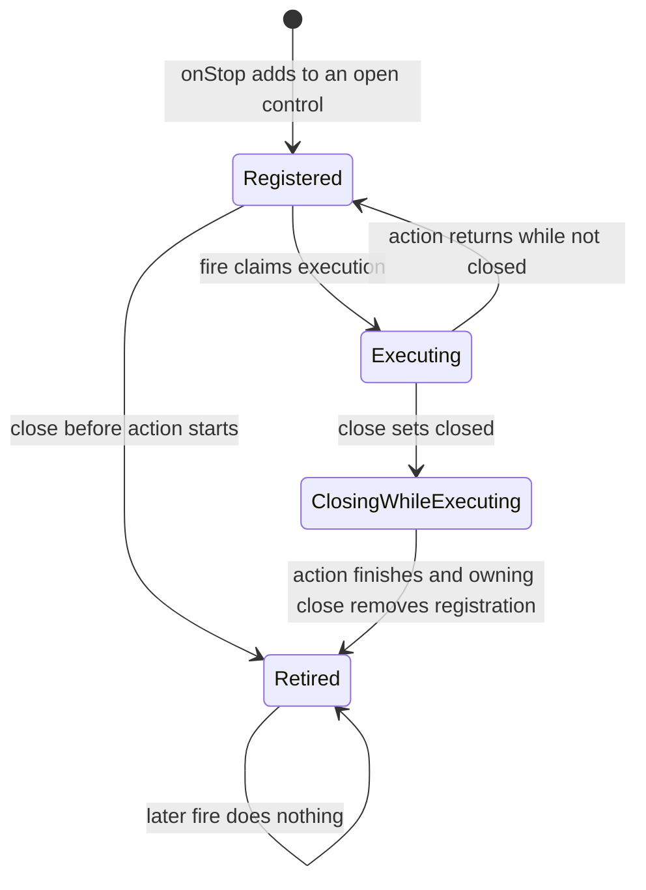
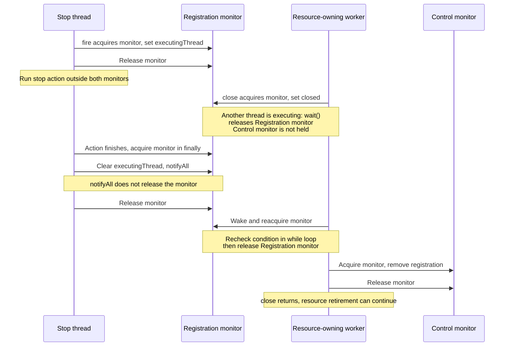
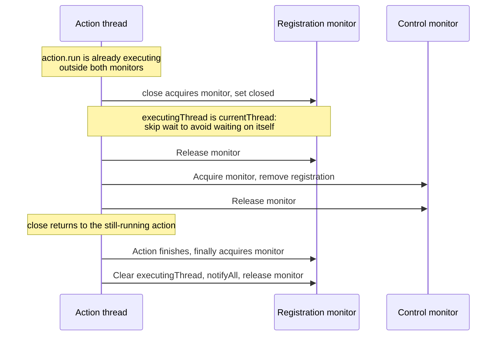

# Stop registration and retirement

A registration makes sure a cancellation action for one claim or lease cannot still be running when that resource is handed to its next owner.

[Catalogue](README.md) · [Stop and deadline control](04-stop-and-deadline-control.md) · [Pool claims and leases](06-pool-claims-and-leases.md)

## The small machine behind `onStop`

[MailSendControl.onStop / Registration.fire / Registration.close](../../modules/core-module/src/main/java/org/simplejavamail/internal/util/concurrent/MailSendControl.java) bind a short internal action to a control. These are not application observers. The action runs on the thread signalling the stop, or on the registering thread when the control was already stopped.

There is **no registration-state enum**. The diagram names combinations of `closed`, `executingThread` and membership in the control's `registrations` list. Closing and executing are independent: setting `closed` blocks a future start but does not make an action already in progress disappear.

Returning to `Registered` after `fire` is literal: the code clears `executingThread`, not the list membership. Normal control flow still signals each registration at most once because the parent accepts only the first stop and takes one snapshot. `Registration` itself does not keep a separate “has fired” bit.

The self-close case needs one qualification: an action can close its own registration, removing membership and returning while that action is still executing. Its final `finally` block clears `executingThread` afterwards. This is a deliberate no-self-wait exception, not an exception thrown to the caller.

## Events, guards and threads

| Event | Guard / transition | Thread |
|---|---|---|
| `onStop(action)` on an open, unstopped control | Add the new registration under the control monitor. | Registering caller/worker. |
| `onStop(action)` on an open, already stopped control | Add under control monitor; call `fire` after releasing it. | Registering thread executes the action immediately. |
| `onStop(action)` after control closing began | Mark this new, not-yet-shared registration closed; never add or fire it. | Registering thread. |
| Parent's first stop snapshots registrations | Snapshot under control monitor; visit each `fire` outside it. | Cancellation requester, deadline worker or thread discovering an overdue boundary. |
| `fire()` | Under registration monitor, return if closed or already executing; otherwise store current thread. Run the action outside the monitor. | Signalling/registering thread, not automatically an executor worker. |
| Action completes or throws | In `finally`, clear executing thread and `notifyAll` under registration monitor. | Action's executing thread. |
| `close()` with no action running | Mark closed under registration monitor; release it; remove from parent list under control monitor. | Resource owner/finisher. |
| `close()` while another thread runs the action | Mark closed, then wait until `executingThread` clears; remove from parent list afterwards. | Closing thread waits; action thread remains free to finish. |
| `close()` from the action itself | Mark closed; skip waiting because the executing thread is the current thread; remove membership. | Action's executing thread. |

Adding and selecting a stop snapshot are serialized by the same control monitor: a registration either gets selected by the stop snapshot, or sees the recorded stop and fires itself afterwards. If `close` races with a snapshot already taken, the snapshot may still contain it, but `fire` checks the registration's own `closed` flag.

## Lock map

| Lock | Exact state protected | What must happen outside it |
|---|---|---|
| Parent `MailSendControl` monitor | List membership and parent stop/lifetime state | `Registration.fire`, `Registration.close`, action execution and waiting for an action. |
| This `Registration` monitor | `closed`, `executingThread` | Action execution; acquiring the parent monitor to remove membership. |
| No lock | Final `action` reference | `action.run()` can acquire its resource's own locks, but must remain a short control operation. |

The one initialization exception is `onStop` after the control has finished: it sets `closed` on a newly constructed registration before publishing it. Subsequent lifecycle access uses the registration monitor.

No `Atomic*`, `volatile` or `ThreadLocal` field participates in this machine. Avoid adding a parent-lock → registration-lock nesting dependency: the existing code snapshots first and releases the parent monitor precisely so the subsequent action/fence can proceed independently.

### Closing while a stop action is running

`wait()` is inside a loop to handle spurious wake-ups and repeated interruption. If the closer is interrupted, it remembers that fact but keeps waiting for the fence; after removing list membership, it restores the calling thread's interrupt flag. Abandoning the wait early would allow the action to escape into a later lease generation.

There is no timeout on this fence. A stop action that never returns can therefore hold up resource retirement. Registered actions must not invoke application observers, complete application futures or wait for work whose progress depends on the closing worker.

### Closing from inside the action

Self-close does not grant permission to reuse a resource while its action is still running. The ordinary production ownership paths close from the finishing/resource-owning thread and depend on that path returning before reuse.

## Who registers what, and when it is retired

| Registration site | Action | Lifetime and dependency |
|---|---|---|
| [MailSendOperation constructor](../../modules/simple-java-mail/src/main/java/org/simplejavamail/mailer/internal/MailSendOperation.java) | `retireQueuedOperation` | Retired by the operation's `control.close`. It atomically retires only queued work and hands terminal reporting to the separate completion worker; it does not run the observer itself. |
| [BatchTransportEngine.claim](../../modules/batch-module/src/main/java/org/simplejavamail/internal/batchsupport/BatchTransportEngine.java) | `ClaimControl.requestCancellation` | A try-with-resources registration surrounds the upstream pool claim. It is closed before the method proceeds with the acquired lease. This wakes the claimant; it does not cancel whichever borrower currently owns a connection. |
| [LifecycleDelegatingTransportImpl constructor](../../modules/batch-module/src/main/java/org/simplejavamail/internal/batchsupport/LifecycleDelegatingTransportImpl.java) | Request this `SmtpTransportLease`'s cancellation, if supported | `signalTransportUsed` fences before release. `signalTransportFailed` requests abort, then fences and invalidates; invalidated disposal is awaited before returning. |
| [MailTransportLifecycleResolver.registerAbort](../../modules/core-module/src/main/java/org/simplejavamail/internal/util/MailTransportLifecycleResolver.java) | Provider adapter's transport abort action | Direct/unpooled transport ownership, shared simple-batch transport, or an open-connection opening/per-email scope. Call sites use try-with-resources. A timed send requires a real abort capability; untimed unsupported transports receive a no-op action. |

Direct abort call sites are [TransportRunner.sendOnNewTransport](../../modules/simple-java-mail/src/main/java/org/simplejavamail/mailer/internal/util/TransportRunner.java), [SendMailsInSimpleBatchClosure.sendEmailsUsingSingleTransport](../../modules/simple-java-mail/src/main/java/org/simplejavamail/mailer/internal/SendMailsInSimpleBatchClosure.java), and [SendMailsWithOpenConnectionClosure.openSmtpTransport / sendOnOpenConnection](../../modules/simple-java-mail/src/main/java/org/simplejavamail/mailer/internal/SendMailsWithOpenConnectionClosure.java). Each registration belongs to that concrete resource scope, not globally to a Jakarta Mail `Session`.

During a simple batch, the shared transport's registration remains active across per-email observer notifications. Pausing the deadline does not pause explicit cancellation. In an open-connection scope, each email's registration is retired before returning to the caller's between-email application code; the shared connection itself remains open.

## Ordering and failure rules

- Selecting an action is not the same as starting it. A selected action whose registration is closed before `fire` acquires its monitor does nothing.
- The action never executes under either bookkeeping monitor. Resource-level locks belong to the action's implementation; see [pool claims and leases](06-pool-claims-and-leases.md) and [Angus transport abort](07-angus-transport-abort.md).
- `RuntimeException` from an action is logged and ignored, then the `finally` block wakes closers. `Error` is not swallowed: the fence bookkeeping still runs, but an error can interrupt the parent's remaining snapshot traversal. This is not blanket isolation of arbitrary fatal failures.
- Normal `Registration.close` from another thread returns only after the action has left `action.run` and cleared its executing marker. It removes list membership after releasing its own monitor.
- Parent `MailSendControl.close` first sets `finished`, then closes its snapshot outside the parent monitor. A concurrent second parent close returns immediately; the first caller owns that full fence. Do not replace the resource-specific close with a check of the parent's lifetime flag.
- Ordinary pooled sends normally report outcomes after healthy release or invalidated disposal settles; a throwing healthy-release path can bypass the disposal join, as documented in [pool claims and leases](06-pool-claims-and-leases.md). Shared-connection sends intentionally report each email while the connection remains in scope. See [cross-machine contracts](08-cross-machine-contracts.md).

## Tests and remaining blind spots

| Test | What it actually forces |
|---|---|
| [MailSendControlTest.closingRegistrationFencesAnAlreadyRunningAction](../../modules/core-module/src/test/java/org/simplejavamail/internal/util/concurrent/MailSendControlTest.java) | Holds the action on a latch, starts a named closing thread, then verifies `WAITING` with `Registration.close` on its stack before releasing the action. It checks the close future and thread both terminate afterwards. |
| `MailSendControlTest.deadlineSignalsAndRetiredRegistrationsNeverFire` | Retires one action before a scheduled timeout; it is not invoked while the still-registered action is invoked. |
| `MailSendControlTest.firstStopReasonWinsAndLateResourceRegistrationSeesIt` | A registration added after cancellation runs immediately and repeated cancellation does not run it again. |
| [MailSendExecutionControlTest.poolAcquisitionCanBeCancelledWithoutAbortingItsCurrentBorrower](../../modules/simple-java-mail/src/test/java/org/simplejavamail/mailer/MailSendExecutionControlTest.java) | Waits until a worker is in the upstream `ClaimAttempt.awaitAvailability` timed wait before cancelling. The current borrower then completes, and its same connection is reused successfully; the cancelled claimant submits no email. |
| `MailSendExecutionControlTest.cancellationAbortsThePooledAttemptAndTheNextLeaseHasFreshFacts` | Cancels blocked SMTP phases, verifies the terminal outcome, then sends again and checks fresh recipient facts. A late request on the old handle cannot affect another send. |
| `MailSendExecutionControlTest.simultaneousHealthyLeasesAreUnaffectedByOneAbortedLease` | Concurrent healthy attempts remain accepted with their own recipient facts while one lease is aborted. |
| `MailSendExecutionControlTest.aPoolSizeOneObserverCanSendAgainAfterTheCancelledLeaseIsDisposed` | The observer performs a synchronous nested send through a size-one pool after a cancelled attempt; the nested send succeeds. |

Coverage limit: there is no dedicated forced-interleaving test here for interruption and restoration of a waiting closer, self-close, two simultaneous closers, or an action throwing an `Error`. Those paths are described from source. The diagrams expose the assumptions for review; they do not establish deadlock freedom by themselves.

Next: [Pool claims, lease ownership and disposal](06-pool-claims-and-leases.md).
