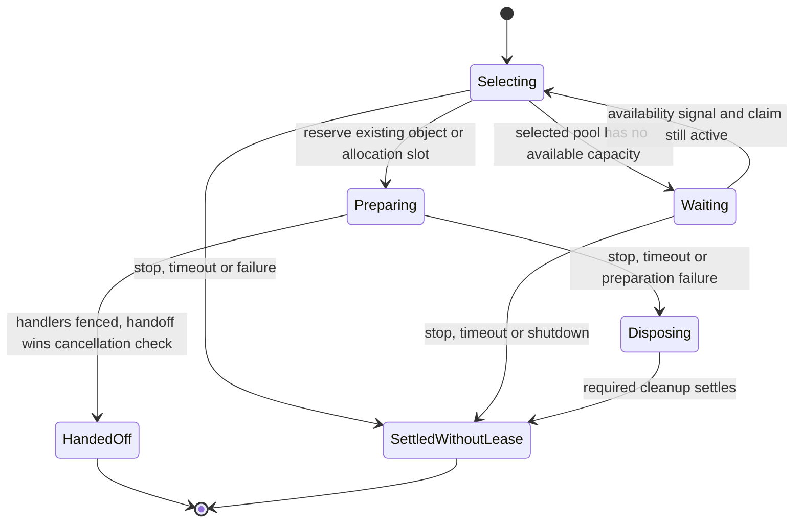
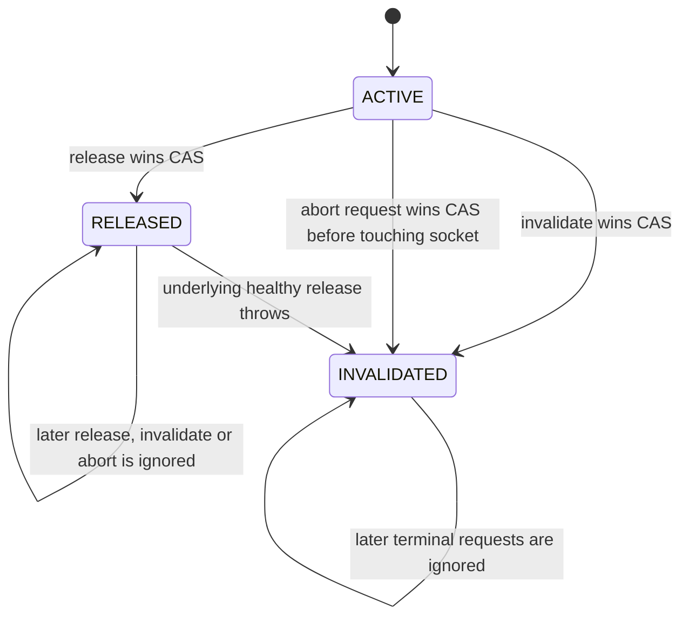
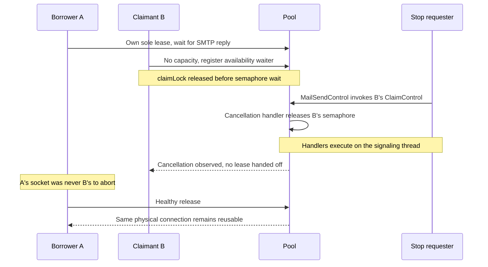
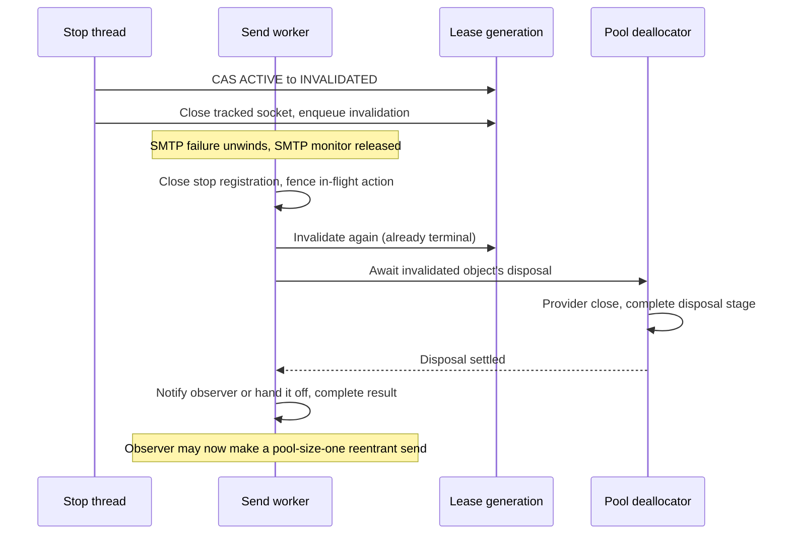

# Pool claims and transport leases

This machinery lets one send stop waiting for, or using, a connection without taking that connection away from another send.

[Catalogue](README.md) · [Stop registration](05-stop-registration.md) · [Angus transport abort](07-angus-transport-abort.md)

## Where this fits

An ordinary send follows `TransportRunner.sendUsingConnectionPool()` → `BatchTransportEngine.claim()` → the upstream SMTP/cluster/generic pools. After the claim returns, `LifecycleDelegatingTransportImpl` owns the lease until the send either returns it healthy or invalidates it. This page describes that path, not a new public send API.

There are two different controls, with a deliberate handoff between them:

| Ownership period | Stop action | What it may affect |
|---|---|---|
| Waiting, connecting or checking an existing connection for reuse | A fresh upstream `ClaimControl.requestCancellation()` | This pending acquisition and any resource still being prepared for it |
| After the pool hands off an exclusive lease | That lease's optional `TransportCancellation.request()` | Only the physical connection owned by this lease generation |
| After healthy release | Neither old control has authority | A subsequent borrower must remain unaffected |

`PoolSettings.toSmtpClusterConfig()` supplies `MailTransportLifecycleResolver::findAbortAction` to the SMTP pool. The allocator can therefore register physical abort **before connecting**, rather than waiting until there is a finished lease. The implementation of that abort is covered on the [Angus page](07-angus-transport-abort.md).

### Source trail and dependency baseline

| Layer | Source to read |
|---|---|
| SJM ownership | [TransportRunner][runner]: `sendUsingConnectionPool()`; [BatchTransportEngine][engine]: `claim()`, `release()`, `invalidate()` |
| Lease completion fence | [LifecycleDelegatingTransportImpl][delegate]: `signalTransportUsed()`, `signalTransportFailed()`, `awaitInvalidatedDisposal()` |
| Capability wiring | [PoolSettings][settings]: `toSmtpClusterConfig()` |
| SMTP pool **4.1.0** | [SmtpTransportLease][lease], [TransportAllocator][allocator], [SmtpConnectionPoolClustered][smtp-cluster] |
| Clustered pool **4.1.0** | [ResourceClusters][clusters], [ResourcePools][pools], [ResourcePool][resource-pool] |
| Generic pool **2.5.0** | [GenericObjectPool][generic], [ClaimAttempt][claim-attempt], [ClaimControl][claim-control], [AllocationContext][allocation-context] |

These versions are the chain selected by the [batch-module POM](../../modules/batch-module/pom.xml), the [SMTP 4.1.0 POM](https://github.com/simple-java-mail/smtp-connection-pool/blob/4.1.0/pom.xml) and the [clustered 4.1.0 POM](https://github.com/bbottema/clustered-object-pool/blob/4.1.0/pom.xml). Upstream links are pinned to those tags; revisit this page when that chain changes.

## Acquisition: reserve, prepare, hand off

These are **derived phases**, not a Java enum. They summarize the controlled-claim route through the three upstream libraries. `ClaimAttempt`/`AllocationContext` carry the actual budget and cancellation checks.

The preparation-failure path may have no materialized resource to dispose. A newly created partial transport is closed by `TransportAllocator`; a generic-pool object is invalidated and, for controlled claims, its disposal completion is awaited. The diagram does not imply that cleanup always succeeds.

| Event or boundary | Guard and transition | Acting thread |
|---|---|---|
| Enter `BatchTransportEngine.claim()` | Check `claimsOpen`, cluster membership and sticky Session identity; for a timed send, require abort support for every registered Session in the cluster | Send worker, or synchronous caller |
| Start controlled acquisition | Register the claim stop action; use `min(send remaining budget, configured claim timeout)`; clustered layers narrow the same running budget rather than restarting it | Same claimant |
| No capacity | Record the waiter under generic `claimLock`; release it before waiting on the attempt's semaphore | Same claimant |
| Cancellation or mail-send deadline | SJM's stop registration calls the fresh `ClaimControl`; its cooperative handlers wake the waiter and, during preparation, abort its transport | Cancellation requester or deadline worker; an already-stopped registration fires on the registering thread |
| Resource prepared | Detach/fence acquisition handlers outside generic bookkeeping; under `claimLock`, `ClaimControl.handOffUnlessCancelled()` decides whether ownership can transfer | Claimant |
| Claim returns after engine shutdown began | Recheck `claimsOpen`, invalidate the returned lease and fail instead of publishing it | Claimant |
| Successful claim | Add the lease to `activeLeases`; the SJM acquisition registration is closed before installing the lease-specific registration | Claimant |

There is a small interval between acquisition handoff and lease registration. It is not an unobserved stop: `MailSendControl.onStop()` immediately invokes the newly registered lease action if the stop was already recorded.

## Lease: only one terminal transition wins

These names **are the actual `SmtpTransportLease.State` enum**. They describe ownership, not SMTP acceptance or physical-disposal completion.

| Event | Guard, side effect and next boundary | Acting thread |
|---|---|---|
| Healthy ordinary send finishes | Fence the SJM stop registration, then call `lease.release()`; only `ACTIVE → RELEASED` returns the resource for reuse | Send worker/caller |
| Stop arrives while the lease is active | `ACTIVE → INVALIDATED` CAS happens **before** the provider abort; then invalidate the generic pool object | Stop-action thread |
| Send fails, except the recognized compatibility-failure route below | Request physical abort when supported, fence the stop registration, invalidate and await disposal; preserve an existing primary failure if cleanup also fails | Send worker/caller |
| `MailSubmissionException` has `MailTransportCompatibilityException` as its cause | `TransportRunner` selects `signalTransportUsed()` instead: return the otherwise healthy connection rather than invalidating it because the payload/provider combination is unsupported | Send worker/caller |
| Release races with a stop already in flight | Fencing waits for the stop action; if the lease is invalidated, release cannot return it healthy and SJM waits for disposal | Send worker/caller |
| Release itself throws | Upstream changes the lease to `INVALIDATED`, requests invalidation and rethrows; SJM waits for disposal before propagating the release failure, suppressing any additional disposal failure | Releasing thread |
| Late handle from an old lease | CAS sees a terminal state; no abort action runs against a new borrower | Any caller retaining that old handle |

`INVALIDATED` is visible before provider abort and disposal have finished. Conversely, `RELEASED` can become visible before `claimedTransport.release()` has finished its work. Do not use the enum as a completion notification.

## Lock and signal ownership

| Identity | Exact state or operation protected | Important boundary |
|---|---|---|
| SJM `BatchTransportEngine.lifecycleMonitor` | `clusterSettings`, identity-based `registeredSessions`, `deadlineClusters`, `claimsOpen`, `shutdownStarted`; admitting a returned lease into `activeLeases` | The actual blocking claim runs outside this monitor. Registration and upstream shutdown delegation still occur inside it; it is not universally an I/O-free monitor. |
| SJM `activeLeases` concurrent set | Concurrent additions, removals and shutdown snapshots | Removals happen in `finally`. It is bookkeeping, not the exclusive-ownership arbiter. |
| SJM `MailSendControl`/`Registration` monitors | Stop reason and the registration's running-action fence | Stop callbacks run outside the control and registration monitors; closing may wait for an in-flight callback. See [registration](05-stop-registration.md). |
| SMTP lease `AtomicReference<State>` | One lease generation's terminal ownership transition | No lease monitor. Winning abort consumes the generation before any physical side effect. |
| Cluster `ResourceClusters.registryLock` / `ResourcePools.registryLock` | Cluster/config registry and the selected cluster's pool registry respectively | Registry locks are released before generic-pool acquisition and resource preparation. |
| Cluster `selectionLock` | Strategy collection creation/reconciliation and load-balancing callbacks | `cycle()` takes selection then the pool-registry lock for its snapshot; it releases selection before claiming the chosen pool. A custom strategy can still block its own caller. |
| Cluster `ResourcePool.initializationLock` and its object monitor | Single pool-factory invocation; publication/retirement of `pool`, `retired`, `initializing` | Factory execution holds initialization, not registry; `beginInitialization()`/`finishInitialization()` briefly acquire the object monitor. Retirement includes late initialization. |
| Generic `claimLock` | Available/reserved/claimed membership and counts, waiter registration, handoff, release/invalidation bookkeeping | Never held across allocator callbacks, availability waits or the controlled failed-claim disposal join. |
| Generic `allocatorLock` | Serialized allocate, reuse preparation and deallocate-for-reuse callbacks | Obtained after releasing `claimLock`; provider checks/connect can block here. |
| Generic `deallocateLock` and disposal condition | Disposal queue and wake-up of its deallocator | `queueInvalidated()` holds `claimLock` then `deallocateLock`; provider final close occurs outside these bookkeeping locks. |
| Upstream `ClaimControl` monitor | One-shot `cancellationRequested`, handler list, atomic cancellation-versus-handoff decision | Handoff takes generic `claimLock` then this monitor; cancellation snapshots handlers here but runs them after leaving it. |
| Upstream `ClaimControl.Registration` monitor | Handler active state and the complete cooperative handler invocation | Unlike SJM's registration, upstream runs the handler while holding this registration monitor. Detach fences it before handoff, outside generic bookkeeping. |
| Upstream `AllocationContext.registrations` monitor | Registered handlers and `handlersDetached` | Detach snapshots here, then closes registrations outside it. |
| Per-claim semaphore | Availability/cancellation wake-up permits | Waiting releases generic bookkeeping; signaling is not ownership transfer. The claimant must recheck and compete for a reservation. |

There is no pool/lease `ThreadLocal` in this slice. The socket-factory binding is [transport-specific](07-angus-transport-abort.md).

### Blocking points and lock order worth preserving

The main lock sequence is **reserve under bookkeeping → unlock → prepare under allocator serialization → unlock → fence cancellation handlers → hand off under bookkeeping**. The handoff may briefly nest `claimLock → ClaimControl`; invalidation nests `claimLock → deallocateLock`. No provider send or close belongs inside those nested regions.

For ordinary SJM sends, `signalTransportUsed()` and `signalTransportFailed()` are called after the transport adapter has released the SMTP monitor. Therefore their registration fence and disposal join do not hold that monitor while the abort/deallocator needs to finish. The join is conditional on the lease being `INVALIDATED`: a healthy release intentionally does not wait for eventual physical disposal.

Exceptional cleanup follows the same disposal boundary. If healthy release throws after invalidating the lease, `signalTransportUsed()` still waits for disposal before propagating the release failure. On the failed-send path, abort, invalidation and disposal can each fail: the first cleanup failure remains primary and later failures are suppressed onto it. A disposal failure therefore neither skips the wait nor replaces an earlier failure. `TransportRunner` retains an existing send failure and attaches the cleanup failure to it.

The SJM engine's post-claim shutdown check invalidates the late lease under `lifecycleMonitor`, but does not join disposal there. `stopClaimsAndInvalidateActiveLeases()` closes admission and snapshots under the monitor, then invalidates outside it. Its direct invalidation is not the same as requesting the optional monitor-independent abort, and does not forcibly stop arbitrary operation callbacks.

### Race: cancel a waiter without touching the current borrower

### Race: abort wins while a send is unwinding

The deallocator may run concurrently with the original send unwinding; it can need the SMTP monitor. That is why the wait is after the adapter returns, not inside its send monitor.

## Invariants and scope boundaries

- Acquisition cancellation cannot revoke an already handed-off resource; lease cancellation is a separate generation-bound capability.
- An aborted lease cannot become reusable. A stale handle cannot abort the next borrower, even when that borrower gets the same `Transport` instance.
- Ordinary pooled-send notification happens after healthy release or invalidated-disposal settlement, including exceptional release and invalidation paths. Cleanup failure can still fail the send or be attached to its existing failure; disposal acknowledgement is not a success guarantee.
- A confirmed SMTP acceptance is a fact about that submission. Invalidating its transport afterwards does not retract it and does not establish delivery to an inbox.
- A timed cluster claim validates **all** its registered Sessions, because non-sticky selection may choose a Session other than the Mailer's own. Future registrations into that marked cluster must also support abort.
- The standalone `BatchTransportExecutor` shares this lease engine but is not automatically instrumented with Mailer observers or `MailSendControl`; ordinary facade operations pass no send control.
- `sendMailsInSimpleBatch` and `withOpenConnection` are **not this pooled-lease path**. They own one direct transport and notify for each reached email while that transport is still in scope. Simple batch uses one send budget; open-connection opening and each email have separate budgets. See [SendMailsInSimpleBatchClosure][simple-batch] and [SendMailsWithOpenConnectionClosure][open-connection].
- Cancellation is a functional signal, not `Thread.interrupt()`. A real interrupted acquisition is a separate path: `BatchTransportEngine` restores the interrupt flag and wraps the cause.
- Custom token suppliers, allocators, DNS, provider code and cleanup can be non-cooperative. A stop request does not promise an immediate completed result, nor permit handing off a late resource after cancellation wins.

## Regression evidence and remaining boundaries

These links identify actual assertions, not a claim that every possible interleaving has been enumerated.

| Test method | What it establishes |
|---|---|
| [MailSendExecutionControlTest][execution-tests] — `poolAcquisitionCanBeCancelledWithoutAbortingItsCurrentBorrower()` | Waits until a worker is in upstream `ClaimAttempt.awaitAvailability`, then cancels. The owner remains pending, later succeeds, and another send reuses its single connection; the cancelled claimant submits nothing. |
| Same class — `simultaneousHealthyLeasesAreUnaffectedByOneAbortedLease()` | Cancels a blocked send alongside twelve others with a four-connection limit; healthy receipts retain their own recipient addresses. |
| Same class — `aPoolSizeOneObserverCanSendAgainAfterTheCancelledLeaseIsDisposed()` | A failure observer synchronously sends another email with pool size one and obtains `ACCEPTED` before the original result completes. It exercises the completion/reuse ordering; it is not a standalone direct assertion on every disposal-stage transition. |
| Same class — `cancellationAbortsThePooledAttemptAndTheNextLeaseHasFreshFacts()` | Blocks greeting, EHLO, AUTH, MAIL, RCPT, DATA and final response; checks exact observer failure/receipt identity, fresh subsequent recipient facts and harmless repeated/late cancellation. |
| [BatchTransportExecutorTest][batch-tests] — `failedAsyncOperationsWakeAlreadyWaitingAttempts()` | Confirms the second caller has reached the upstream wait before the first fails; the waiter obtains a replacement transport for core sizes zero/one, sticky/non-sticky selection and connection/recipient failures. |
| [LifecycleDelegatingTransportImplTest][cleanup-tests] — `failedReleaseWaitsForInvalidatedDisposal()` / `failedInvalidationStillWaitsForDisposal()` | Latches the disposal wait after release or invalidation throws; the cleanup call remains pending until disposal settles. Healthy release does not wait for eventual disposal. |
| Same class — `disposalFailureDoesNotReplaceReleaseFailure()` / `disposalFailureDoesNotReplaceInvalidationFailure()` / `abortFailureRetainsBothInvalidationAndDisposalFailures()` | Runtime exceptions and errors retain the first cleanup failure and suppress later failures. A separate regression guards against self-suppression. |
| [SMTP 4.1.0 SmtpLeaseCancellationTest][lease-tests] — `aDelayedHandleFromAnOldLeaseCannotAbortTheNextBorrower()` / `releaseAndAbortRaceHasExactlyOneWinner()` | A latched stale handle cannot affect the next borrower; sixty release-versus-abort races have one terminal winner and the corresponding abort count. |
| Same upstream class — `disposalAcknowledgementWaitsForCleanupAndRetainsFailure()` | Blocks final close, observes pending disposal, then checks its cleanup failure; cancelling a detached stage cannot cancel real cleanup. |
| [SMTP 4.1.0 SmtpClaimCancellationTest][claim-tests] — `cooperativePreparationAbortExitsTheOperationAndDisposesBeforeReturning()` / `cancelledPreparationWaitsForPartialTransportDisposal()` | Controlled connect/readiness cancellation closes the resource before claim settlement; a deliberately blocked partial-resource close keeps settlement pending. |

The finite race test is not exhaustive scheduling verification. Provider-independent support still depends on an honest abort capability, and these tests do not turn blocking third-party callbacks into preemptible code.

[engine]: ../../modules/batch-module/src/main/java/org/simplejavamail/internal/batchsupport/BatchTransportEngine.java
[delegate]: ../../modules/batch-module/src/main/java/org/simplejavamail/internal/batchsupport/LifecycleDelegatingTransportImpl.java
[settings]: ../../modules/batch-module/src/main/java/org/simplejavamail/internal/batchsupport/PoolSettings.java
[runner]: ../../modules/simple-java-mail/src/main/java/org/simplejavamail/mailer/internal/util/TransportRunner.java
[simple-batch]: ../../modules/simple-java-mail/src/main/java/org/simplejavamail/mailer/internal/SendMailsInSimpleBatchClosure.java
[open-connection]: ../../modules/simple-java-mail/src/main/java/org/simplejavamail/mailer/internal/SendMailsWithOpenConnectionClosure.java
[execution-tests]: ../../modules/simple-java-mail/src/test/java/org/simplejavamail/mailer/MailSendExecutionControlTest.java
[batch-tests]: ../../modules/batch-module/src/test/java/org/simplejavamail/batch/BatchTransportExecutorTest.java
[cleanup-tests]: ../../modules/batch-module/src/test/java/org/simplejavamail/internal/batchsupport/LifecycleDelegatingTransportImplTest.java
[lease]: https://github.com/simple-java-mail/smtp-connection-pool/blob/4.1.0/smtp-connection-pool/src/main/java/org/simplejavamail/smtpconnectionpool/SmtpTransportLease.java
[allocator]: https://github.com/simple-java-mail/smtp-connection-pool/blob/4.1.0/smtp-connection-pool/src/main/java/org/simplejavamail/smtpconnectionpool/TransportAllocator.java
[smtp-cluster]: https://github.com/simple-java-mail/smtp-connection-pool/blob/4.1.0/smtp-connection-pool/src/main/java/org/simplejavamail/smtpconnectionpool/SmtpConnectionPoolClustered.java
[clusters]: https://github.com/bbottema/clustered-object-pool/blob/4.1.0/src/main/java/org/bbottema/clusteredobjectpool/core/ResourceClusters.java
[pools]: https://github.com/bbottema/clustered-object-pool/blob/4.1.0/src/main/java/org/bbottema/clusteredobjectpool/core/ResourcePools.java
[resource-pool]: https://github.com/bbottema/clustered-object-pool/blob/4.1.0/src/main/java/org/bbottema/clusteredobjectpool/core/ResourcePool.java
[generic]: https://github.com/bbottema/generic-object-pool/blob/2.5.0/src/main/java/org/bbottema/genericobjectpool/GenericObjectPool.java
[claim-attempt]: https://github.com/bbottema/generic-object-pool/blob/2.5.0/src/main/java/org/bbottema/genericobjectpool/ClaimAttempt.java
[claim-control]: https://github.com/bbottema/generic-object-pool/blob/2.5.0/src/main/java/org/bbottema/genericobjectpool/ClaimControl.java
[allocation-context]: https://github.com/bbottema/generic-object-pool/blob/2.5.0/src/main/java/org/bbottema/genericobjectpool/AllocationContext.java
[lease-tests]: https://github.com/simple-java-mail/smtp-connection-pool/blob/4.1.0/smtp-connection-pool/src/test/java/org/simplejavamail/smtpconnectionpool/SmtpLeaseCancellationTest.java
[claim-tests]: https://github.com/simple-java-mail/smtp-connection-pool/blob/4.1.0/smtp-connection-pool/src/test/java/org/simplejavamail/smtpconnectionpool/SmtpClaimCancellationTest.java
