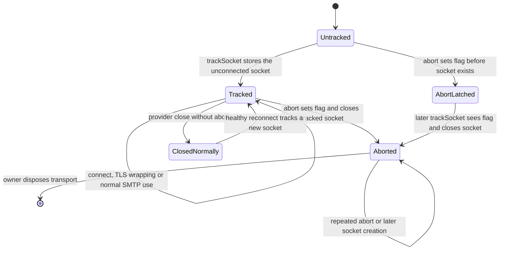
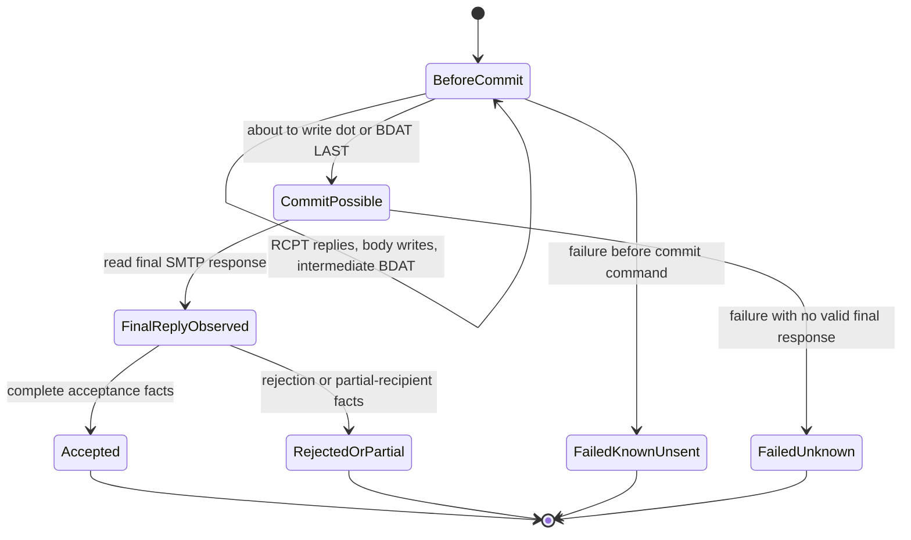
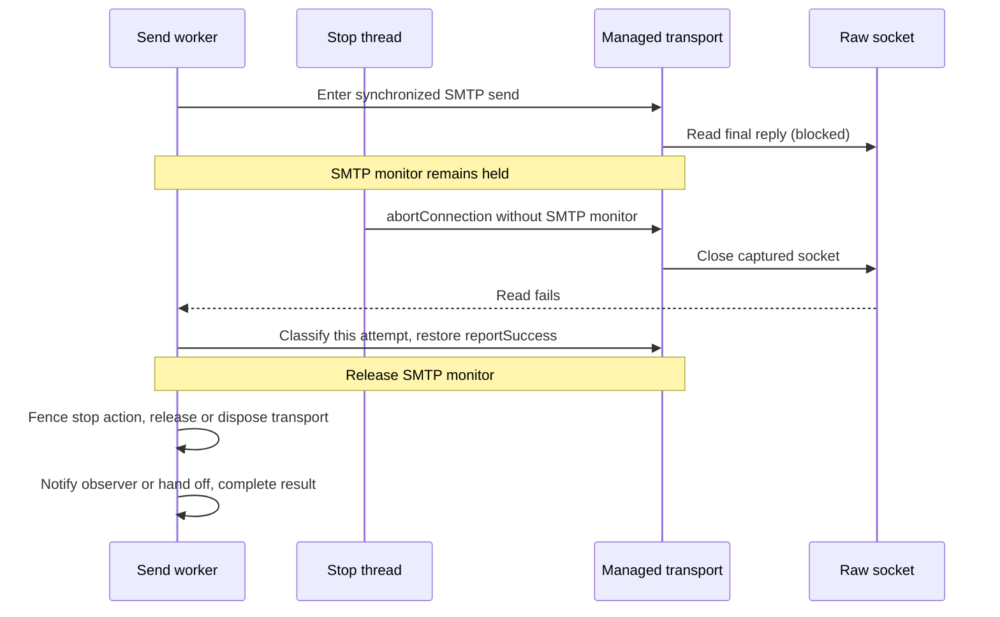
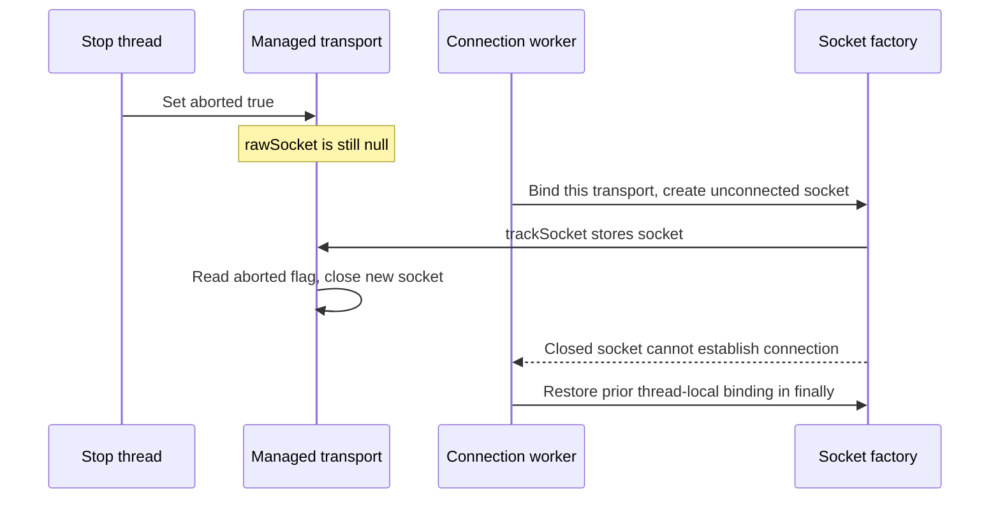

# Angus transport abort and submission boundaries

This adapter keeps a socket handle where cancellation can reach it even while Angus is holding its SMTP monitor and waiting for the network.

[Catalogue](README.md) · [Pool claims and leases](06-pool-claims-and-leases.md) · [Cross-machine contracts](08-cross-machine-contracts.md)

## Why `Transport.close()` is not the stop signal

In the selected **Angus 2.0.5** implementation, `SMTPTransport.protocolConnect()`, `sendMessage()` and `close()` synchronize on the transport. If one thread is waiting for a server reply inside `sendMessage()`, a different thread calling ordinary `close()` first has to acquire that same monitor. It cannot be relied upon to break that wait.

SJM still lets Angus implement SMTP. `ManagedAngusTransport` adds a separate, atomic reference to the physical socket and a latched abort bit. `abortConnection()` closes that socket **without acquiring the SMTP monitor**. The send/connect thread then encounters the resulting I/O failure, unwinds its own protocol state, and constructs the normal caller-facing result.

This is provider integration, not behavior guaranteed by the Jakarta Mail API. The [root POM](../../pom.xml) pins Angus 2.0.5; its [SMTPTransport source][upstream-transport] and [SocketFetcher source][upstream-sockets] are the upstream baseline for these hooks. Recheck the hooks and regression tests when upgrading it.

## Source trail and capability selection

| Responsibility | Source and methods |
|---|---|
| Discover optional connection lifecycle support | [MailTransportLifecycleResolver][resolver]: `configureOwnedSession()`, `findAbortAction()`, `registerAbort()`, `requireAbortSupport()` |
| Cross-module contract | [MailTransportLifecycleAdapter][spi]: `createAbortAction()` requires an idempotent, monitor-independent, latched action |
| Install only on a compatible SJM-owned Session | [AngusMailTransportLifecycleAdapter][lifecycle]: `supportsProvider()`, `configureOwnedSession()`, `hasCustomSocketFactory()` |
| Capture the unconnected socket for the right transport | [AngusSocketFactory][factory]: `bind()`, `createSocket()`, `restore()` |
| Abort and record this attempt's protocol boundaries | [ManagedAngusTransport][managed]: `protocolConnect()`, `trackSocket()`, `abortConnection()`, `sendMessage()`, `sendCommand()`, `readServerResponse()` |
| Keep sending and response capture atomic | [AngusMailTransportAdapter][adapter]: `sendMessage()`, `sendWithRecipientReporting()` |
| Interpret captured facts | [AngusSubmissionResult][submission]: `classifySubmission()`, `describeRecipients()`, `retryDisposition()` |
| Coordinate ordinary-send cleanup | [TransportRunner][runner]: `sendOnNewTransport()`, `closeAfterSend()`, `sendUsingConnectionPool()`; the exceptional healthy-release failure is described on the [lease page](06-pool-claims-and-leases.md) |

`ServiceLoader` discovers the lifecycle adapter through the module's [service registration](../../modules/angus-mail-provider-module/src/main/resources/META-INF/services/org.simplejavamail.api.mailer.spi.MailTransportLifecycleAdapter). The resolver rejects multiple matching lifecycle adapters; finding a capability must not connect or acquire a resource.

For a newly created SJM-owned Session using the stock Angus SMTP/SMTPS provider, configuration installs `AngusSocketFactory` and selects `ManagedAngusTransport`. Socket-factory fallback is disabled so an aborted tracked socket cannot be silently replaced by an untracked fallback connection. An application-provided ordinary or SSL socket factory is left untouched and does not acquire this capability by assumption.

## Physical connection state

These states are **derived from `rawSocket` and `aborted`**, not an enum. A healthy, connected transport can carry many consecutive send attempts; abort is latched for the lifetime of this transport instance.

`Untracked` means no socket has been captured **yet**, not that the adapter advertised a capability for an incompatible transport. The exact raw reference may retain a closed socket; these labels describe its lifecycle, not merely whether the reference is null. An aborted instance is not reset for reuse.

| Event | Guard and state change | Acting thread |
|---|---|---|
| `protocolConnect()` begins | Bind this transport into the Session socket factory's `ThreadLocal`, retaining any previous binding | Connection claimant or synchronous caller; SMTP monitor held |
| Socket factory creates a socket | Create it unconnected, store it with `rawSocket.set()`, then test `aborted` | Same connection thread |
| Stop action runs | Set `aborted = true`; close the currently tracked socket if present; never take the SMTP monitor | Cancellation requester, deadline worker, or worker installing an already-stopped registration |
| Abort predates socket publication | `trackSocket()` observes the latched flag and closes the new socket before it can escape | Connection thread |
| Connect succeeds, fails or throws | Restore/remove the thread-local binding in `finally`; failed connection also closes tracked socket | Connection thread |
| Provider cleanup after abort | Normal synchronized `close()` clears Angus state; the expected socket-caused close failure is suppressed only on the explicitly aborted route | Send worker/caller or pool deallocator |

The atomic handshake covers both orders: either abort finds the published socket, or publication sees the previously set abort flag. TLS normally wraps the tracked underlying socket; closing that underlying handle also breaks the TLS operation. The implementation preserves Angus's SOCKS-versus-HTTP-proxy choice, and Angus retains responsibility for connection timeouts, binding, TLS and SMTP negotiation.

## Submission state is a separate machine

Closing a connection says nothing by itself about whether the SMTP server accepted the message. The following are **derived interpretation phases**, not a new public enum and not an independent timer state machine.

This diagram is intentionally a summary: `AngusSubmissionResult` combines final reply, exception chain, recipient groups and per-occurrence RCPT observations. A final response alone does not override an unrelated outer failure or prove that every intended recipient was accepted.

| Boundary | What the code records | Why it matters |
|---|---|---|
| Start `ManagedAngusTransport.sendMessage()` | Reset `commitPossible`, `readingFinalResponse`, `pendingRecipient`, `finalResponse` and `recipientResponses`; set `sending` | Pooled attempts cannot inherit these per-attempt facts. |
| `RCPT TO:` command | Append one pending recipient slot before sending, then fill its observed response | Repeated mailbox occurrences stay distinct; a started RCPT with no response is not an invented success. |
| Dot terminator or `BDAT ... LAST` | Set `commitPossible` **before** writing the command | A failed write can have partially or fully reached the peer; local failure is not proof of non-acceptance. Intermediate BDAT chunks do not cross this boundary. |
| Final response read | Record the valid SMTP response and clear `readingFinalResponse` | A missing final response after possible commit yields unknown acceptance and duplicate-risk advice. |
| Failure before commit | Map all not-invalid envelope occurrences as unsent | Successful RCPT replies are not DATA acceptance. |
| Successful send/accepted reporting exception | Return the accepted result without a post-send stop check rewriting it | A late stop can end the connection but cannot undo already observed acceptance. |

`TransportRunner` translates an actual send failure through `MailSendControl`, preserving the receipt where one exists. It does not turn a successfully returned receipt into cancellation simply because the stop flag changed afterwards. On the unpooled path, a stop-related cleanup failure after an accepted receipt is handled without discarding that receipt. Other cleanup failures are not universally suppressed.

## Lock, atomic and thread-local ownership

| Identity | Protected state or operation | Rules for callers |
|---|---|---|
| The actual `SMTPTransport` monitor | Angus protocol operations; SJM `commitPossible`, `readingFinalResponse`, `sending`, `pendingRecipient`, `finalResponse`, `recipientResponses`; temporary `reportSuccess` change and result capture | `AngusMailTransportAdapter` holds this monitor across sending, classification and restoration. Hook methods/getters rely on that caller-held monitor even where not declared `synchronized`. |
| `AtomicReference<Socket> rawSocket` | Publication/read of the currently tracked physical socket handle | Abort reads it without waiting for SMTP state. Socket closure can race safely with connect/write/read. It does not protect Angus's response fields. |
| `AtomicBoolean aborted` | Permanent abort latch | Set before reading/closing the socket. Socket publication checks it after storing the socket. |
| Per-`AngusSocketFactory` `ThreadLocal<ManagedAngusTransport>` | Which transport is currently connecting on this thread | Set only around `protocolConnect()` and restored in `finally`; identifies ownership absent from `SocketFactory.createSocket()` arguments. It is not a per-email global map. |
| Session properties | Pre-publication factory configuration | Do not mutate caller-owned Sessions or put cancellation state here. `hasTrackedSocketConfiguration()` verifies the expected factory identity, disabled fallback and lack of SSL factory override when advertising capability. |
| Upstream lease CAS and SJM registration fence | Authority to invoke abort while this generation owns the transport | See [pool claims and leases](06-pool-claims-and-leases.md). Atomic socket access alone would not stop a stale callback from hurting a new borrower. |

### Blocking points and lock order

- The send/connect worker holds the SMTP monitor while waiting for network I/O, TLS negotiation and some payload/provider work. That serialization is intentional: the connection is one SMTP conversation.
- Abort **must not** acquire that monitor. Its only network action is closing the captured socket; it does not run the observer, complete the send future or call synchronized `Transport.close()`.
- The send adapter restores `reportSuccess` and snapshots/classifies facts before releasing the SMTP monitor. It does not hold it across the lease-release fence or disposal join.
- Pool disposal may call synchronized provider `close()` and therefore wait for the original send to leave the monitor. Where SJM waits for invalidated disposal, that wait occurs after the send has unwound out of that monitor. The [lease page](06-pool-claims-and-leases.md) documents the exceptional healthy-release failure that bypasses its subsequent disposal join.
- A socket abort is not `Thread.interrupt()`. Non-cooperative payload code or DNS that is not currently blocked on the captured socket may still delay unwinding. The code does not claim a hard wall-clock completion bound for arbitrary application code.

### Race: stop while the SMTP worker holds its monitor

This sequence shows an **ordinary** send's normal abort/disposal path, not the exceptional healthy-release failure noted above. A simple-batch/open-connection observer is deliberately called while its shared transport remains in scope; its scope owner closes later.

### Race: the stop arrives before any socket exists

## Boundaries to keep explicit

- `MailTransportAdapter` provides submission facts; `MailTransportLifecycleAdapter` provides connection-abort capability. Supporting one does not imply supporting the other.
- A different provider can implement the same SPI contract. The managed-Angus hooks and their detailed boundary observations are not automatically available when swapping providers.
- Caller-owned Sessions are not rewritten. A timeout is allowed only if their selected transport genuinely exposes an abort action; a stock caller-created Angus Session does not automatically become managed.
- An SJM-owned Session with custom socket factories is left untouched. Unsupported total-timeout configurations fail before connecting. Untimed cooperative sending remains possible.
- `CustomMailer` owns its transport: SJM cannot install physical abort in that callback, and a configured total timeout is rejected except in logging-only mode. It does not invalidate the callback's successful return solely because a request arrived late. `withOpenConnection` does not accept `CustomMailer` at all.
- Simple batches hold one direct connection and control; open-connection scope uses separate opening/per-email controls. Their observers run per reached email before the shared connection is closed, unlike ordinary pooled-send completion.
- `ACCEPTED` is SMTP acceptance, not final delivery. After possible commit with a missing final response, retrying may duplicate the email; no automatic retry is introduced here.

## Regression evidence and limits

| Test method | What it establishes |
|---|---|
| [AngusSocketAbortTest][socket-tests] — `capturedSocketAbortsBlockedAngusWithoutItsMonitor()` | A loopback peer withholds greeting/EHLO/AUTH/MAIL/RCPT/DATA/final/QUIT replies or stalls implicit-TLS/STARTTLS handshake. With 30-second socket timeouts, a separate abort and the blocked call settle within two-second test waits. |
| Same class — `abortBeforeCreationClosesTheLateSocket()` | Requests abort before `connect()`; connect fails and the listening server accepts no connection. |
| Same class — `abortInterruptsSocksNegotiationBeforeSmtpCanConnect()` | Stops while a loopback SOCKS peer withholds its negotiation response, before SMTP begins. |
| [MailSendExecutionControlTest][execution-tests] — `deadlineAbortsBlockedIoLongBeforeTheSocketTimeout()` | Exercises seven real pooled SMTP phases using a 500-ms send deadline with 30-second session timeouts; observes `MailSendTimeoutException`. |
| Same class — `bdatCancellationDistinguishesIntermediateChunksFromPossibleCommit()` | An intermediate blocked chunk produces rejected/known-unsent submission; `BDAT LAST` with no reply produces `UNKNOWN` and `DUPLICATE_RISK`; the next send succeeds. |
| Same class — `acceptedUnpooledSendSurvivesDeadlineDuringQuitCleanup()` | Disables the batch module for this call, blocks QUIT after acceptance and confirms an accepted receipt survives the deadline during cleanup. |
| Same class — `nonCooperativeDataSourceDelaysCompletionButCannotSendAfterCancellation()` | Holds attachment reading in application code; cancellation leaves the result pending until that code returns, then the send fails without submitting a message. |
| Same class — `unknownCallerSessionRejectsATotalDeadlineWithoutOpeningASocket()` | Rejects an unmanaged caller Session, leaves its socket-factory setting unchanged and observes no accepted connection. |
| [AngusSubmissionResultTest][submission-tests] — `reportingPreferenceIsRestoredAfterSuccessAndBothKindsOfFailure()` | Verifies transport-local `reportSuccess` restoration after success, checked failure and unchecked failure for either original setting; Session properties are not mutated. |
| Same class — `finalReplyFromExceptionRemainsAvailableWhenIdenticalToPreviousTransportState()` | Retains a real final reply from the current exception even when the snapshot comparison supplies no new response. |

The loopback tests establish specific interleavings, not deadlock freedom. They do not establish cancellation latency for every OS/network/DNS failure, every application socket factory or every future Angus release. TLS/SOCKS coverage should not be described as proof for untested custom network integrations.

[resolver]: ../../modules/core-module/src/main/java/org/simplejavamail/internal/util/MailTransportLifecycleResolver.java
[spi]: ../../modules/core-module/src/main/java/org/simplejavamail/api/mailer/spi/MailTransportLifecycleAdapter.java
[lifecycle]: ../../modules/angus-mail-provider-module/src/main/java/org/simplejavamail/internal/mailprovider/angus/AngusMailTransportLifecycleAdapter.java
[factory]: ../../modules/angus-mail-provider-module/src/main/java/org/simplejavamail/internal/mailprovider/angus/AngusSocketFactory.java
[managed]: ../../modules/angus-mail-provider-module/src/main/java/org/simplejavamail/internal/mailprovider/angus/ManagedAngusTransport.java
[adapter]: ../../modules/angus-mail-provider-module/src/main/java/org/simplejavamail/internal/mailprovider/angus/AngusMailTransportAdapter.java
[submission]: ../../modules/angus-mail-provider-module/src/main/java/org/simplejavamail/internal/mailprovider/angus/AngusSubmissionResult.java
[runner]: ../../modules/simple-java-mail/src/main/java/org/simplejavamail/mailer/internal/util/TransportRunner.java
[socket-tests]: ../../modules/angus-mail-provider-module/src/test/java/org/simplejavamail/internal/mailprovider/angus/AngusSocketAbortTest.java
[execution-tests]: ../../modules/simple-java-mail/src/test/java/org/simplejavamail/mailer/MailSendExecutionControlTest.java
[submission-tests]: ../../modules/angus-mail-provider-module/src/test/java/org/simplejavamail/internal/mailprovider/angus/AngusSubmissionResultTest.java
[upstream-transport]: https://github.com/eclipse-ee4j/angus-mail/blob/2.0.5/providers/smtp/src/main/java/org/eclipse/angus/mail/smtp/SMTPTransport.java
[upstream-sockets]: https://github.com/eclipse-ee4j/angus-mail/blob/2.0.5/core/src/main/java/org/eclipse/angus/mail/util/SocketFetcher.java
