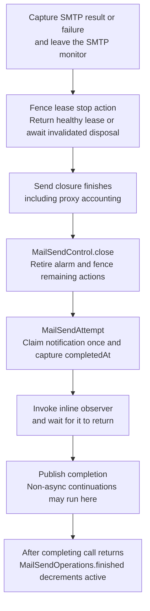
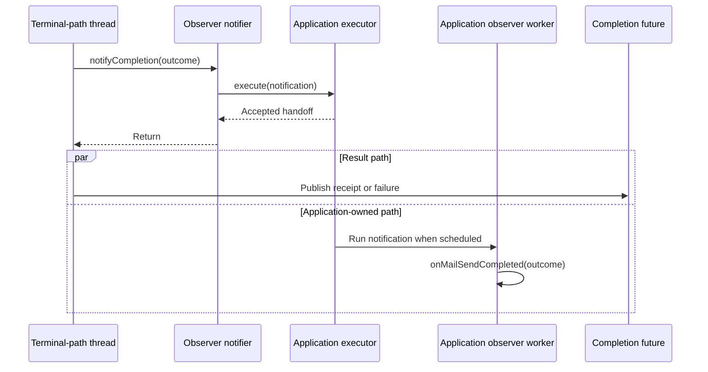
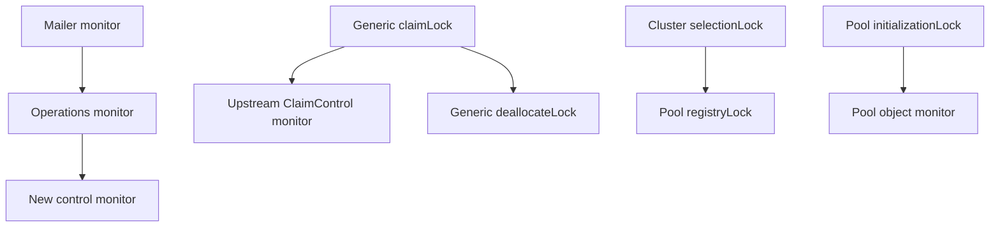
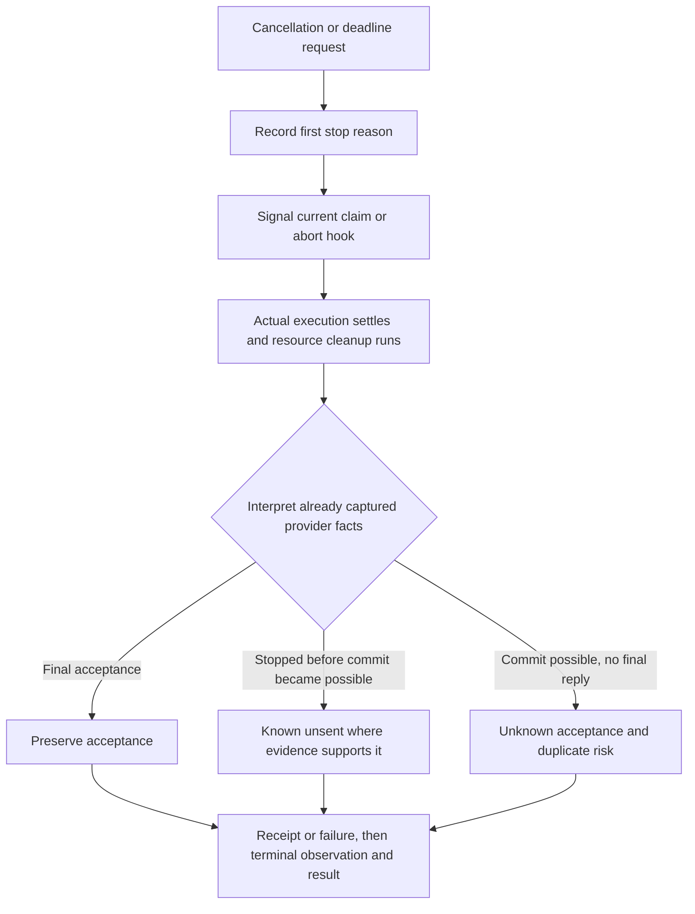

# 08 — Cross-machine contracts

[Catalogue](README.md) · [Previous: Angus transport abort](07-angus-transport-abort.md)

The difficult cases cross class boundaries: a queued operation is cancelled while the send workers are busy, a transport is returned while an abort callback is still running, or an observer starts another send. This page connects the individual machines without pretending they share one global state or lock.

## One ordinary send, from work to observation

For an ordinary pooled send, the resource boundary comes before the observation boundary. The per-lease abort registration is fenced before healthy reuse. On failure, cancellation can start invalidation/disposal before that fence; the finishing path then fences the registration and waits for invalidated disposal before reporting the outcome. This wait also applies when release or invalidation throws: the first cleanup failure remains primary and later failures are suppressed. See [exceptional cleanup paths](06-pool-claims-and-leases.md).

The following steps run on the send worker or synchronous caller. Abort and pool disposal can run concurrently; the resource steps below identify what this finishing thread waits for on the normal path.

The terminal observer is not invoked while holding the operation's state CAS, control monitor, registration monitor, or SMTP monitor acquired by this send path. This is a scoped statement, not a claim that arbitrary application code never runs under any lock: MIME/data-source code can run inside provider work, and application callers may themselves hold locks across a synchronous send.

The path is assembled by [MailerImpl](../../modules/simple-java-mail/src/main/java/org/simplejavamail/mailer/internal/MailerImpl.java) (`beginEmailOperation`, `prepareMailSend`, `sendPreparedEmail`), [SendMailClosure](../../modules/simple-java-mail/src/main/java/org/simplejavamail/mailer/internal/SendMailClosure.java), [TransportRunner](../../modules/simple-java-mail/src/main/java/org/simplejavamail/mailer/internal/util/TransportRunner.java), and [MailSendOperation.finish](../../modules/simple-java-mail/src/main/java/org/simplejavamail/mailer/internal/MailSendOperation.java). See [lease ownership](06-pool-claims-and-leases.md) for the actual CAS and fencing details.

For an ordinary **unpooled** send, `TransportRunner` closes the direct transport and then closes its abort registration before returning. Do not generalize the pooled lease's fence-before-return rule into “every transport's abort registration closes before transport cleanup”: the direct path keeps abort available during cleanup. A stop during QUIT cleanup must not erase acceptance already observed.

## Observer handoff changes one completion boundary

The optional observer executor belongs to the application. Simple Java Mail hands over an immutable outcome before publishing its result; it does not wait for a separately scheduled observer body to finish or drain that executor during Mailer shutdown.

There is no guaranteed order between the observer body's start/finish and future completion in this second diagram. The executor may start the observer before `execute` returns. A direct executor can run it entirely inline; a blocking executor can delay handoff. The overload is an executor handoff, not a guarantee of a new thread.

[MailSendObserverNotifier](../../modules/simple-java-mail/src/main/java/org/simplejavamail/mailer/internal/MailSendObserverNotifier.java) logs and ignores observer `RuntimeException`s. It also logs an executor's rejected handoff without falling back to running the observer inline; that notification is not delivered by the library. These rules do not promise isolation from every `Error`, a permanently blocked callback, or an executor that violates its own contract.

[MailSendAttempt](../../modules/simple-java-mail/src/main/java/org/simplejavamail/mailer/internal/MailSendAttempt.java) claims per-email notification once with an `AtomicBoolean`. Its `completedAt` precedes the observer call/handoff, and its `completed` field is not the operation's future state. The `MailSendOutcome` is a snapshot, not a control channel: changing observation scheduling does not let an observer change the selected SMTP receipt or caller-facing failure.

## Thread ownership

These are roles, not a promise of a particular thread name. A custom executor may choose different scheduling, including direct execution.

| Work | Normal execution role | Relevant boundary |
| --- | --- | --- |
| Ordinary email preparation/validation | Submitting caller, including async entry points | Preparation failure reports there; no send closure, sending lease or network connection has been acquired. Deadline-support validation may construct and close a probe `Transport`. |
| Bounded executor admission | Submitting caller | May wait for capacity; admission timeout is distinct from the total send budget. |
| Accepted async send | Configured send executor | Worker owns work, resource cleanup, and normal completion. |
| Cancelled/timed-out operation still in `QUEUED` | Per-Mailer completion executor after retirement wins its CAS | Does not need an occupied send worker to become free. No email work runs. |
| Cancellation signal | Thread calling `requestCancellation()` | Registered stop actions run synchronously outside the control monitor. The method requests stopping; it does not await the send result. |
| Deadline signal | Per-Mailer deadline scheduler | Signals stop actions; queued terminal notification is handed to the separate completion executor. |
| Inline terminal observation | The terminal-path thread above | Slow callbacks delay their result and can delay subsequent callbacks on the single queued-completion worker. |
| Offloaded observation | Application executor | Mailer waits for handoff, not separately scheduled application processing. |
| Non-async future continuations | A thread completing the future, or the attaching caller if already complete | Offloading observers does not also offload these continuations. |
| Graceful resource shutdown | Dedicated shutdown thread | Waits for owned executor/operation drain, then closes pools. |

The deadline scheduler therefore does not have to run a slow terminal observer to signal a different operation's timeout. This is not an absolute real-time guarantee: stop actions themselves execute synchronously and may take time. Nor does it make all queued cancellations complete concurrently: their terminal paths share one completion worker per Mailer.

`withinOperation` is a same-thread dynamic context marker, not a JDK scheduling primitive. It lets `Mailer.close()` reject a self-wait from an operation/inline callback. It does not transfer execution or acquire a monitor. See [Mailer lifecycle](02-mailer-lifecycle.md) for nested context restoration and the guard's limits.

## The three send shapes have different scopes

| Shape | Tracked work and timeout budget | Transport ownership | Observation and final completion |
| --- | --- | --- | --- |
| Ordinary send | One operation; preparation, admission, queue wait, execution and relevant cleanup share its budget. | One pooled lease, or one direct transport without the batch module. | Per-email observation after cleanup; then its result. |
| Simple batch | One operation/control for the whole batch. Iterator access and preparation occur during execution. | One intentionally shared direct transport for the SMTP batch. | Per-email observation while transport stays open; aggregate result after batch cleanup. First failure stops untouched emails. |
| `withOpenConnection` | One tracked outer scope; opening and each send have separate operations/budgets. Application gaps are not per-send work. | One direct transport stays in scope across the callback's sends; an abort can make it unusable. | Per-email observation after that send's abort registration closes, while shared transport remains in scope. Outer scope retires after callback and transport cleanup. |

There is no per-email callback for an untouched batch element. A queued batch cancelled before execution does not open the iterable. `withOpenConnection` is not an async batch handle: its callback controls which emails are submitted on that shared connection.

Sources: [SendMailsInSimpleBatchClosure](../../modules/simple-java-mail/src/main/java/org/simplejavamail/mailer/internal/SendMailsInSimpleBatchClosure.java), [SendMailsWithOpenConnectionClosure](../../modules/simple-java-mail/src/main/java/org/simplejavamail/mailer/internal/SendMailsWithOpenConnectionClosure.java), and [MailerImpl.withOpenConnection](../../modules/simple-java-mail/src/main/java/org/simplejavamail/mailer/internal/MailerImpl.java).

### Wall-clock observation versus the timeout budget

Outcome timestamps use `Instant`; deadline accounting uses a monotonic elapsed-time budget. Inline observer work, or time spent handing an outcome to an observer executor, pauses that budget. It does **not** remove that elapsed time from wall-clock timestamps. In a simple batch this prevents one email's observer from consuming the next email's remaining send budget. For ordinary sends, control has already been closed by the time the terminal observer runs.

The batch's transport is still shared during its per-email observer pause. Deadline pausing does not disable explicit cancellation: a caller can still request cancellation and abort the active shared transport. Application gaps inside an open-connection callback are outside individual send budgets rather than being timed and later subtracted. Its outer scope still keeps shutdown from declaring that callback finished.

## Cross-machine lock and handoff rules

There is no single global lock order that explains the whole implementation. CAS transitions decide ownership; monitors protect short state changes; registration fences prevent callbacks from outliving the resource generation they target. The following is a boundary map, **not a claim that all these locks are nested**.

| Boundary | Protection and ordering | Why it matters |
| --- | --- | --- |
| Owner admission/drain → control construction | `MailSendOperations` monitor can enclose construction/scheduling of a new control. | A newly accepted operation is counted before shutdown can drain. |
| Stop decision → registration action | Snapshot under control monitor; release it before `Registration.fire`. Action runs outside registration monitor too. | Pool/socket work does not execute under the central control monitor. |
| Registration completion → resource reuse | Owning `Registration.close` waits for another thread's action, releasing its registration monitor during `wait`. Control-list removal occurs after releasing that monitor. | A late callback cannot follow an old lease into its next borrower. Self-close is a specifically weaker path; see page 05. |
| SMTP command/response → physical abort | Provider command/response state is protected by the SMTP transport monitor; raw-socket abort deliberately does not acquire it. | Closing blocked I/O can release the worker that currently holds the SMTP monitor. |
| SMTP result → observer | Capture provider facts, leave provider work, finish resource disposition, then construct/dispatch ordinary-send outcome. | Prevent stale facts and reentrant pool-size-one sends from sharing the old lease. |
| Terminal notification → owner decrement | Control cleanup and notification happen before `finished()` acquires the owner monitor. | Inline observer and synchronous completion continuations remain part of tracked work. |
| Owner drain → internal drain future | `drained.complete(null)` currently occurs inside the owner monitor. | Do not claim that every future completion in the system happens outside locks; this is the internal drain signal, not the public send future. |

The following arrows **do** mean acquiring the destination while still holding the source lock. They show selected nested paths observed in the SJM/control and upstream-pool code, not every lock in the process. Upstream names and versions are detailed on [page 06](06-pool-claims-and-leases.md).

There is deliberately no control → SJM registration edge: the control releases its monitor before firing or fencing registrations. Registration removal takes the two monitors sequentially, not nested. Likewise, raw-socket abort does not acquire the SMTP monitor. Those missing dependencies are important design choices; this partial graph is not evidence that arbitrary application callbacks or upstream internals cannot form other cycles.

The existing proxy closure also has its own counter/proxy monitors and proxy lifecycle. [AbstractProxyServerSyncingClosure](../../modules/simple-java-mail/src/main/java/org/simplejavamail/mailer/internal/AbstractProxyServerSyncingClosure.java) increments accounting in its constructor and decrements in `run`'s `finally`. This is why send closures are constructed only when execution starts: rejected or retired queued work must not acquire proxy accounting. This catalogue does not yet audit the proxy's complete internal lock graph.

## Requests are not transport facts

This is a conceptual decision sketch, not the complete SMTP status classifier. Rejections and partial-recipient failures have their own receipt facts. A stop that arrives after acceptance does not prove that the email was unsent; closing a socket is not an SMTP rollback. Conversely, an earlier unrelated failure must not be relabelled merely because cleanup later crosses a deadline. See the [failure snapshot](04-stop-and-deadline-control.md) and [Angus commit boundary](07-angus-transport-abort.md).

The public [MailSend](../../modules/core-module/src/main/java/org/simplejavamail/api/mailer/MailSend.java) separates `requestCancellation()` from `getCompletion()`. Completion views are detached: cancelling or manually completing one of those `CompletableFuture` views does not cancel the send or overwrite the library's authoritative result. Request stopping on the send handle; inspect its completion for what actually happened.

## Progress depends on more than lock order

- A running non-cooperative data source may not return immediately after cancellation. Socket abort prevents further useful SMTP progress but cannot forcibly make arbitrary application code return. Completion waits for real execution/cleanup, not an invented early result.
- An inline observer can block its own send's result indefinitely. A completion continuation can do the same to owner retirement, even with observer offloading enabled.
- An inline observer that performs a **synchronous** reentrant send can reuse a returned pool-size-one lease. An observer that queues more work to a saturated executor and waits for it can instead create an application-level dependency cycle. These are different cases.
- `Mailer.close()` detects important same-operation/owned-worker self-waits. Explicitly waiting on `shutdownConnectionPool()` from that callback, cross-Mailer dependency cycles, and arbitrary application locks are not generally prevented by that convenience guard.
- Provider-neutral receipts and cooperative stop checks do not imply provider-neutral physical abort. For actual sending, total deadlines require a supported lifecycle adapter; an unsupported caller-owned Session or `CustomMailer` is rejected for a configured total timeout before sending. Logging-only mode is exempt. See page 07 for supported Angus wiring and limitations.

These are constraints visible in the implementation, not newly reproduced defects. Keep them in mind when interpreting “no deadlock” or “cancellation is immediate.”

## Regression evidence

This documentation pass inspected the test sources; rendering these diagrams does not rerun or strengthen those tests. The mechanism pages include their own narrower evidence and coverage limits.

| Contract | Test source and exact method(s) | What the test exercises |
| --- | --- | --- |
| Queued retirement frees capacity before terminal application work | [MailSendOperationTest](../../modules/simple-java-mail/src/test/java/org/simplejavamail/mailer/internal/MailSendOperationTest.java): `queuedCancellationReclaimsCapacityBeforeInvokingItsObserver` | Holds the send worker busy; the cancelled operation's observer itself checks that the queue is already empty. |
| Deadline signalling stays separate from slow terminal observation | Same class: `slowTerminalObserverCannotBlockOtherDeadlineSignals` | A slow queued-terminal observer does not prevent another control from recording timeout. It does not prove arbitrary stop actions are nonblocking. |
| Inline observation remains tracked; handoff does not await application processing | Same class: `inlineObserverTimeIsNotPartOfTheSendDeadlineAndShutdownWaitsForIt`; [MailSendObserverDispatchTest](../../modules/simple-java-mail/src/test/java/org/simplejavamail/mailer/MailSendObserverDispatchTest.java): `outcomeIsHandedOffBeforeCompletionWithoutWaitingForItsApplicationExecutor` | Exercises the two different observation boundaries rather than assuming all executors run asynchronously. |
| Rejection and direct executors keep their explicit semantics | Same dispatch class: `rejectedHandoffDoesNotReplaceSuccessfulOrFailedSends`, `directExecutorRunsInlineAndCallbackRuntimeExceptionsRemainIsolated` | Rejected handoff is not a failed send; direct execution remains inline. |
| Batch timeout excludes inline observer time | [MailSendExecutionControlTest](../../modules/simple-java-mail/src/test/java/org/simplejavamail/mailer/MailSendExecutionControlTest.java): `inlineObserversBetweenBatchEmailsDoNotConsumeTheBatchBudget` | Blocking/time-consuming observation between reached emails does not exhaust the shared send budget. |
| Shared scopes differ from ordinary leases | Same class: `openConnectionGetsFreshPerEmailBudgetsAndDoesNotTimeApplicationGaps`, `simpleBatchSharesOneBudgetAndDoesNotReachUntouchedEmails`, `cancelledQueuedSimpleBatchNeverOpensTheIterable` | Fresh per-email budgets, whole-batch budget, and lazy untouched input. |
| Cancelled pool claims do not abort the current borrower | Same class: `poolAcquisitionCanBeCancelledWithoutAbortingItsCurrentBorrower` | Holds the borrower's final SMTP reply; confirms the waiter is blocked in upstream claim code; cancels it; then completes and reuses the original connection. |
| Lease cleanup precedes ordinary terminal observation | Same class: `aPoolSizeOneObserverCanSendAgainAfterTheCancelledLeaseIsDisposed` | A synchronous send from the observer succeeds after disposal at pool size one. |
| Late stop does not erase acceptance; non-cooperative work remains real work | Same class: `acceptedUnpooledSendSurvivesDeadlineDuringQuitCleanup`, `nonCooperativeDataSourceDelaysCompletionButCannotSendAfterCancellation` | Acceptance survives abort during cleanup; blocked source delays completion until released. |

## When changing this contract

Recheck all three send shapes, both observer modes, queued versus running stop, admission rejection, and shutdown. In particular, moving result publication before an inline observer or moving lease return after it is a contract change, not an internal cleanup. Update the relevant public Javadocs and the [API expansion workflow](../../API_EXPANSION_WORKFLOW.md) checks when public behavior changes.
