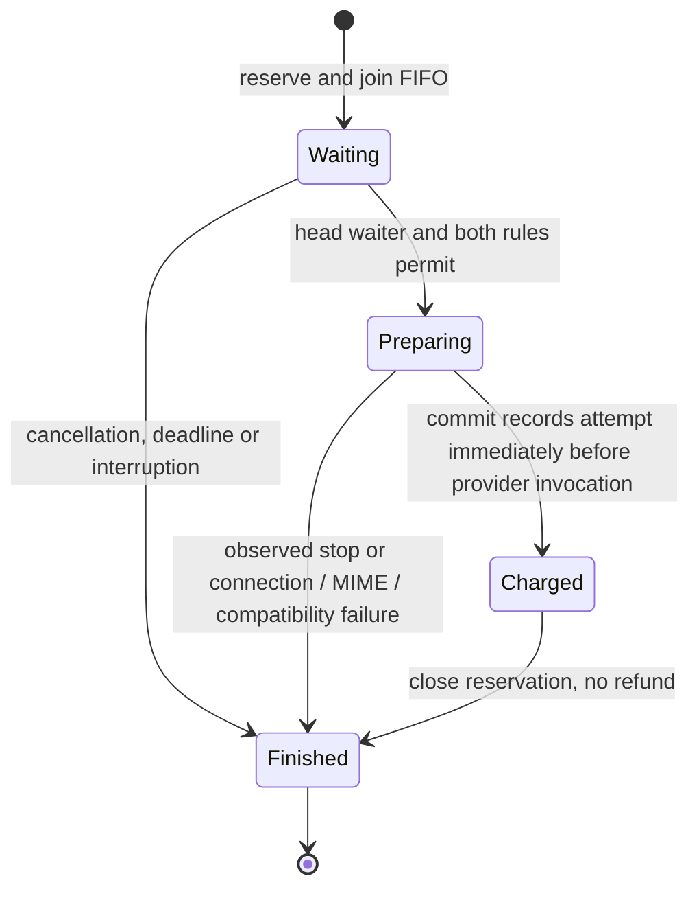
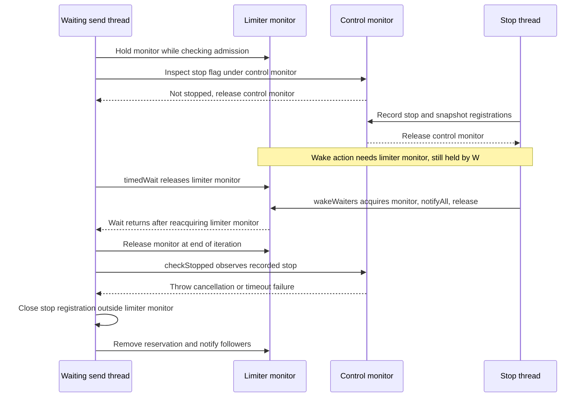

# 09 — Sending limits

This page describes factory-scoped sending limits implemented under [#751](https://github.com/bbottema/simple-java-mail/issues/751).
The configuration decision is [ADR 0027](../adr/0027-factory-scoped-sending-limits.md);
the [verification report](../research/sending-limits-verification.md) records the integration runs.

[Catalogue](README.md) · [Stop control](04-stop-and-deadline-control.md) · [Stop registrations](05-stop-registration.md) ·
[Pool claims and leases](06-pool-claims-and-leases.md)

## Where the gate sits

For an ordinary send, `MailerImpl` selects a pool registration without borrowing from it. `SelectedPoolTransport` carries that registration's
`SendingAllowance`; it is not read from the Session's mutable conversion context. Direct, custom and retained-connection sends keep the
invoking Mailer's allowance. `EmailSendingAllowance` projects recipient headers through the same MIME recipient/header setters, or uses the
explicit envelope override. No body, attachment, protection or message serialization is needed to count the intended recipients.

The send reserves allowance **before constructing `SendMailClosure`**, because that constructor registers authenticated-proxy use.
Only then does the closure start its proxy and `TransportRunner` claim the selected registration. Acquisition cannot select again.
No-limit sends skip envelope projection and diagnostic rate-clock reads.

`TransportRunner` prepares the message on the selected Session. `MailTransportAdapterResolver` charges immediately before invoking the
selected adapter or generic transport, after SJM's own adapter compatibility checks. CustomMailer is charged immediately before its
callback. An unused reservation closes on any earlier failure; a charged reservation never refunds the attempt.

## Reservation transitions

These are conceptual states over `waiters`, `preparing` and `Reservation.finished`, not another Java enum.

Only one reservation per limiter can be preparing. Otherwise several slow acquisitions could accumulate permissions and submit together
later, violating spreading. Once the provider is invoked, another reservation may prepare; the earlier network operation need not finish.
Rolling-window history and optional spacing are evaluated together. Larger recipient costs can block smaller FIFO followers.

### Events, guards and owning threads

| Event | Guard and effect | Thread |
| --- | --- | --- |
| `reserve` with both rules disabled | Return the shared no-op reservation; no clock read, queue insertion or stop registration. | Sending caller/worker. |
| `reserve` with a configured rule | Reject an email larger than the whole recipient allowance, then register the stop wake-up and join `waiters`. | Sending caller/worker. |
| `awaitReservation` admits the head | No other reservation is preparing, both windows permit this cost, and no stop is observed. Remove the head and set `preparing`. Nothing is charged yet. | That waiting caller/worker. |
| Cancellation or deadline signal | Record the stop in `MailSendControl`; its registration invokes `wakeWaiters`. The signal does not remove or charge the reservation itself. | Stop requester, deadline worker or thread discovering an expired deadline. |
| `commit` | Recheck stop, reject a finished/non-owning reservation, charge both windows at one sampled timestamp, clear `preparing`, and notify followers. | Sending caller/worker, immediately before invoking the provider or CustomMailer. |
| `close` before commit | Remove the reservation from the queue or clear its preparation slot, mark it finished, and notify followers. No charge is added. | Reservation owner, including the failure path inside `reserve`. |
| `close` after commit, or repeated close | `finished` is already true; do nothing. A provider rejection or later cleanup failure does not refund the attempt. | Reservation owner. |

The stored `finished` flag means this reservation can no longer act. A charged attempt remains in the rolling-window history until it
expires; `finished` does not mean that SMTP work or the public send operation has completed.

## Locks and stop ordering

| Owner | Protects | Never runs under its monitor |
| --- | --- | --- |
| `FactorySendingLimits` | Named-group agreement, provisional builders and established history | Pool initialization, waiting, SMTP, application callbacks |
| `BatchSupport` | Pool-registration allowance metadata and replacement of per-cluster ownership snapshots | Selection waits, allowance waits, conversion, provider calls |
| `MailSendRateLimiter.monitor` | FIFO, current preparation, charges and reservation completion | MIME, connection setup, provider calls, observers |
| `MailSendControl` | Existing cancellation/deadline state | The limiter's waiting loop or provider calls |

`Object.wait` releases the limiter monitor while waiting. Its stop registration only wakes waiters. The worker checks the stop/deadline
before taking a reservation and again before charging. `requestStop` releases the control monitor before firing registrations, so the
limiter's bookkeeping checks do not introduce a reverse nested-lock edge through the wake callback. Application work stays outside both.
All paths close unused reservations before terminal observation, allowing a pool-size-one observer to send again without retaining them.

There is one short nested-lock edge: **limiter monitor → control monitor**, for stop/budget inspection. There must be no reverse edge:
the control snapshots registrations and releases its monitor before `Registration.fire` can enter `wakeWaiters`. The registration itself
also runs its action outside its own monitor. `reserve` closes that registration outside the limiter monitor, so fencing an already-running
wake action cannot leave the closer holding the lock that action needs. See the [registration fence](05-stop-registration.md).

`SendingRateWindow` has no lock of its own; all its mutable counters and charges are accessed under the owning limiter's monitor.
The factory registry lock is used only during registration, not while reserving, waiting, charging or executing a send.

### Construction and registration ownership

Each Mailer keeps its own allowance reference. The optional pool bridge retains a typed internal `SendingAllowance` reference for each
cluster/Session registration, so another Mailer reusing that Session in a different cluster cannot replace it. Registering incompatible
allowance owners for the same live pool fails explicitly; shared named-group participants can use the same owner.

`BatchSupport` replaces its per-cluster maps on registration/removal instead of modifying maps held by an in-flight selection. Selection
waits happen outside its monitor. After selection, the original and current allowance references must agree for that destination; otherwise
selection fails without charging anything. An unrelated registration change does not invalidate an unchanged destination. Once returned,
the selection retains that allowance, and the upstream selection still rejects acquisition from a retired/replaced pool.

Group creation is provisional while pool initialization runs. The registry counts overlapping builders under its short bookkeeping lock;
initialization runs outside that lock. One successful build establishes the group for the factory's lifetime. Failed builds remove only a
group with no successful participant and no other pending builder. They cannot erase an established group's rules or recent charges.
Earlier constructor validation failures never register at all. No limiter is placed in Session properties.

### Race: cancellation arrives just before the waiter sleeps

This is a source-derived interleaving, not a claim that a test freezes every step below. The waiting thread has already registered its
wake action, joined the FIFO and found that it cannot proceed.

The wake-up cannot slip between the last stop check and releasing the limiter monitor: `wait` releases that monitor atomically with
entering its wait, and `wakeWaiters` needs the same monitor. If the stop was already visible during the earlier check, the worker does
not sleep and its next `checkStopped` throws instead. Spurious wake-ups simply repeat the checks.

### Race: a reservation is granted while cancellation arrives

Taking `preparing` is not charging it. `reserve` checks the control again after leaving its admission loop; an observed stop closes the
unused reservation. If `reserve` has already returned, its caller owns that cleanup and the existing acquisition/preparation paths keep
checking the same control. `commit` performs another stop check before recording a charge.

These checks are not an atomic transaction with cancellation or provider invocation. A stop arriving after `commit`'s final stop check
can race with charging, and a recorded charge is never refunded. It is conservative local attempt accounting, not evidence that a
`MAIL FROM` command was written, SMTP accepted the message, or delivery occurred. Receipt and cancellation arbitration remain owned by
the existing send path, not by this limiter.

## Shared connections and shutdown

Simple batches and `withOpenConnection` intentionally retain their transport during per-email waits. Their initial setup and final teardown
remain outside individual diagnostics. No iterable is opened for a rejected async batch, and untouched entries have no callback or charge.
Long waits can exceed the server's idle timeout; the scope does not silently reconnect or bypass a limit.

Graceful shutdown drains accepted operations, including rate waiters. Closing a Mailer does not discard named-group history: it belongs to
the factory, not a participant or its connection pool. Independent factories, including ones created from the same snapshot, do not share
allowance. There is no process-global limiter registry or additional executor.

`MailSendDiagnostics.getRateLimitWait()` explains deliberate waiting separately from executor scheduling and connection acquisition.
Measurements finish at the existing terminal boundary before observer handoff; receipts and failure arbitration retain their existing meaning.

## Implementation anchors

- [FactorySendingLimits.register][registry]: private registrations, named-group rule agreement and factory-local history ownership.
- [MailSendRateLimiter.reserve / awaitReservation / commit / release][limiter]: FIFO, one preparing reservation, stop registration and charging.
- [SendingRateWindow][window]: weighted expiry, rolling capacity and optional spacing, using the limiter's monotonic timestamps.
- [MailerImpl.sendPreparedEmail][mailer]: ordinary-send ordering before closure construction; [EmailSendingAllowance][context]
  costs recipients and reserves the explicit allowance without serializing the email.
- [MailTransportAdapterResolver][resolver]: charge after SJM compatibility checks, immediately before provider invocation.
- [MailSendControl][control]: stop recording, wake callbacks and registration fencing; the limiter does not add another cancellation machine.

## Regression evidence and limits

The [verification report](../research/sending-limits-verification.md) records the original integration runs and the
holistic-review follow-up. Method names below identify the exact checks in each linked file.

| Test method | What it establishes |
| --- | --- |
| [MailSendRateLimiterTest][limiter-tests] — `cancelledLargeHeadDoesNotBlockASmallerFollowerOrConsumeItsAllowance()` | Clock-read handshakes place a two-recipient head and a one-recipient follower in the FIFO after nine of ten recipients were charged. Cancelling the head lets the follower commit without advancing time. The handshake proves entry into bookkeeping, not an exact instruction boundary inside `wait`. |
| Same class — `cancellationBeforeCommitLeavesNothingCharged()` | Explicitly orders cancellation after reservation and before commit; commit fails and a replacement can charge at the same timestamp. This is not a simultaneous stop-versus-commit race test. |
| Same class — `slowPreparationCannotBankLaterReservationsAndSendsMayOverlapAfterCommit()` | Holds one preparing reservation, advances the fake clock far beyond a period, and commits it. The follower still waits for spacing from that commit, but can proceed before the first reservation is closed. |
| Same class — `abandonedPreparationReleasesAllowanceButClosingASubmissionDoesNotRefundIt()` / `interruptionPreservesTheFlagAndRemovesTheWaitingReservation()` | Unused and repeated closes do not consume allowance; double commit fails; a committed attempt keeps its charge. Interrupting a waiting thread preserves its interrupt flag and allows later use. |
| Same class — `concurrentReservationsCannotDoubleChargeOrLoseAttempts()` | One hundred concurrent tasks finish reserve/commit/close with a hundred-message/recipient budget. A 101st live call reaches bookkeeping without completing and is then cancelled. This bounded run is not an exhaustive interleaving proof. |
| [SendingRateWindowTest][window-tests] — `countsWeightedOccurrencesOverARollingWindowIncludingItsExactBoundary()` / `spreadsByPreviousRecipientCostAndDoesNotAccumulateIdleCredit()` / `spreadingDoesNotReplaceTheRollingCeiling()` | Deterministic timestamps verify weighted expiry, exact boundary acceptance, spacing after idle time and the independent rolling ceiling. Arithmetic tests separately cover rounding, large representable values and monotonic-counter wrap. |
| [MailerSendingLimitsTest][integration-tests] — `pooledWaitHoldsNoLeaseAndCancellationDoesNotConsumeAllowance()` | While a send is at rate bookkeeping, another caller can borrow the sole pooled connection. Cancelling the waiter produces no receipt; a later send reuses the connection. |
| Same class — `waitingParticipantDoesNotStartItsAuthenticatedProxyOrResetTheClosedParticipantsHistory()` | After one participant closes, its named-group history still blocks a replacement. A clock-read handshake confirms the waiting path; no SMTP connection or authenticated proxy listener has started. |
| Same class — `failedAcquisitionAndMimePreparationReleaseReservationButProviderFailureStaysCharged()` / `localAdapterRejectionDoesNotConsumeAnAttempt()` | Pre-invocation connection, MIME and compatibility failures leave allowance available. An invoked provider failure keeps its charge and delays a successor until the fake clock advances. |
| Same class — `poolSizeOneObserverCanSendAgainAfterTheFirstReservationAndLeaseAreReleased()` | A terminal observer performs a synchronous nested send with allowance for two messages and a size-one pool. Both succeed using one connection; this does not claim that a reentrant observer bypasses exhausted limits. |
| Same class — `retainedBatchAndOpenConnectionWaitPerEmailWithoutReconnecting()` | An observer advances the fake clock between emails. Both retained paths record per-email rate measurements and reuse their scoped connection. It does not force a blocked retained-scope wait or reproduce a server idle timeout. |
| [MailSendExecutionControlTest][execution-tests] — `totalDeadlineIncludesSendingLimitWaitWithoutTouchingTheIdlePooledConnection(boolean)` | Sync and async loopback sends time out at the rate gate with no receipt. A connection test still uses the same healthy pooled connection; the server received only the first message. This exercises the real deadline rather than a fake-clock boundary. |
| [FactorySendingLimitsTest][registry-tests] — `namedGroupsShareByFactoryIdentityRatherThanMatchingConfiguration()` / `groupMembersMustAgreeIncludingExplicitlyDisabledRules()` | Equal rules within one named group reuse its limiter; distinct factories and contradictory declarations do not. Integration tests additionally exercise participant closure and independent-factory sending. |
| Same class — `failedInitializationReleasesRulesButCannotRemoveAnEstablishedGroup()` / `concurrentSuccessfulParticipantSurvivesAnotherBuildersRollback()` / `concurrentFailedParticipantsLeaveNoRegisteredRules()` | Failed initialization cannot pin new rules or remove an established group. Latches keep initialization open while another builder succeeds or fails; initialization does not hold the registry lock. |
| [MailerSendingLimitsTest][integration-tests] — `anotherMailerUsingTheSameSessionCannotReplaceTheInvokingMailersLimits()` / `reusedSessionKeepsLimitsAcrossIndividualAndRetainedSendPaths(boolean)` | Another factory reuses the same caller-owned Session without replacing the first Mailer's limits. Individual, custom, batch and open-connection paths retain the intended owner. |
| Same class — `failedMailerConstructionDoesNotKeepItsProvisionalGroupRules()` / `failedPoolRegistrationAlsoReleasesItsProvisionalGroup()` | Both early TLS validation failure and later pool registration failure allow a corrected build with different group rules. |
| [BatchTransportSelectionTest][selection-tests] — `oneSessionCanHaveIndependentLimitsInDifferentClustersButCannotReplaceALivePoolsLimits()` / `selectionRejectsChangedOwnershipButNotAnUnrelatedRegistration(boolean)` | Pool selections retain the selected registration's allowance. A controlled registration change during selection rejects replaced ownership before acquisition, while an unrelated registration does not invalidate the selection. |
| [MailerSendingLimitsTest][integration-tests] — `gracefulShutdownWaitsForAnAcceptedRateWaiterWithoutDiscardingItsCharge()` / `cancellationDuringARetainedBatchWaitStopsBeforeTheNextEmailIsRead()` | Shutdown waits for accepted rate-limited work. Cancellation during a blocked retained batch wait stops before reading the next email and records the rate wait as the failed step. |
| [MailSendExecutionControlTest][execution-tests] — `openConnectionDeadlineCanExpireWhileItsNextEmailWaitsForAllowance()` | A retained scope sends its first email, then times out at the next email's gate, without reconnecting or submitting that email. |
| [MailSendDiagnosticsRecorderTest][diagnostics-tests] — `rateWaitingIsSeparateFromSelectionAndAcquisition()` | Deterministic clock readings keep deliberate rate waiting separate from acquisition before and after it. |

Remaining evidence boundaries: no dedicated test freezes the exact final-stop-check/`wait` or final-stop-check/charge gap shown above.
The shared registration-fence tests cover action retirement, but do not enumerate every limiter-specific late wake-up. Retained waits and
graceful draining now have the focused checks above; no test simulates every server's idle-timeout behavior. None of these diagrams proves
deadlock freedom for arbitrary provider or application callbacks. The verification report distinguishes the new checks
from the earlier 2026-10-01 run.

[registry]: ../../modules/simple-java-mail/src/main/java/org/simplejavamail/mailer/internal/ratelimit/FactorySendingLimits.java
[limiter]: ../../modules/simple-java-mail/src/main/java/org/simplejavamail/mailer/internal/ratelimit/MailSendRateLimiter.java
[window]: ../../modules/simple-java-mail/src/main/java/org/simplejavamail/mailer/internal/ratelimit/SendingRateWindow.java
[mailer]: ../../modules/simple-java-mail/src/main/java/org/simplejavamail/mailer/internal/MailerImpl.java
[context]: ../../modules/simple-java-mail/src/main/java/org/simplejavamail/mailer/internal/EmailSendingAllowance.java
[resolver]: ../../modules/simple-java-mail/src/main/java/org/simplejavamail/mailer/internal/util/MailTransportAdapterResolver.java
[control]: ../../modules/core-module/src/main/java/org/simplejavamail/internal/util/concurrent/MailSendControl.java
[limiter-tests]: ../../modules/simple-java-mail/src/test/java/org/simplejavamail/mailer/internal/ratelimit/MailSendRateLimiterTest.java
[window-tests]: ../../modules/simple-java-mail/src/test/java/org/simplejavamail/mailer/internal/ratelimit/SendingRateWindowTest.java
[integration-tests]: ../../modules/simple-java-mail/src/test/java/org/simplejavamail/mailer/internal/ratelimit/MailerSendingLimitsTest.java
[execution-tests]: ../../modules/simple-java-mail/src/test/java/org/simplejavamail/mailer/MailSendExecutionControlTest.java
[registry-tests]: ../../modules/simple-java-mail/src/test/java/org/simplejavamail/mailer/internal/ratelimit/FactorySendingLimitsTest.java
[selection-tests]: ../../modules/batch-module/src/test/java/org/simplejavamail/internal/batchsupport/BatchTransportSelectionTest.java
[diagnostics-tests]: ../../modules/simple-java-mail/src/test/java/org/simplejavamail/mailer/internal/MailSendDiagnosticsRecorderTest.java
