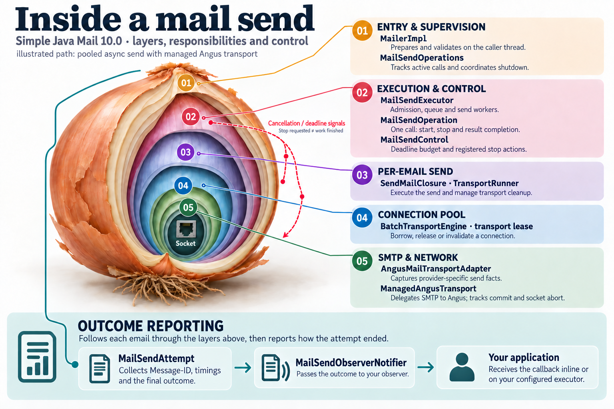
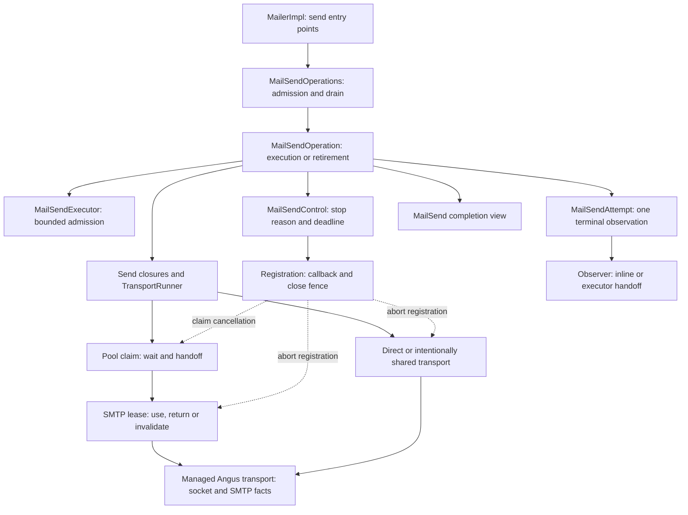

# Concurrency and state-machine catalogue

This is a developer's map of the cooperating state machines behind mail sending. Start here when a cancellation request, blocked worker, callback, or shutdown behaves differently from what you expected. The diagrams explain who owns each transition, which locks protect it, and what has to finish before the next step can happen.

The first collection covers the Phase 2 execution-control implementation on `codex/10.0.0`, including the working-tree changes reviewed on 2026-09-10. It describes implementation behavior, not a released-version guarantee or a proof that every possible interleaving is safe. Read it alongside the [project mechanisms catalogue](../../PROJECT_MECHANISMS_CATALOGUE.md), [coding guide](../../CODING_STYLE_GUIDE.md), and [improvement plan](../../03_SMTP_ROBUSTNESS_IMPROVEMENT_PLAN/README.md).

## Start with the overview

The infographic shows the pooled asynchronous path with managed Angus transport. It maps responsibilities, not monitor nesting or every possible send path. Outcome reporting follows the email across those layers; it is not another transport layer. Open the image for the full-size view, then use the pages below for transitions and locking rules.

The [infographic source and maintenance notes](inside-a-mail-send.md) record its scope, the shared asset, and the review checkpoint for each remaining improvement phase.

## Start with the question you have

| Question | Page |
| --- | --- |
| Can a queued send start after cancellation? Who completes its result? | [01 — Send operation](01-send-operation.md) |
| What does shutdown wait for? Why is `withinOperation` needed? | [02 — Mailer lifecycle](02-mailer-lifecycle.md) |
| Who waits when the executor is full? What if the last worker expires? | [03 — Executor admission](03-executor-admission.md) |
| What wins between cancellation, a deadline, and an earlier failure? What pauses the clock? | [04 — Stop and deadline control](04-stop-and-deadline-control.md) |
| How do we know an old cancellation callback cannot touch a reused connection? | [05 — Stop registration](05-stop-registration.md) |
| Who owns a connection while waiting for a pool claim, using it, and returning it? | [06 — Pool claims and leases](06-pool-claims-and-leases.md) |
| How can cancellation unblock Angus without waiting for its SMTP lock? What if SMTP already accepted the email? | [07 — Angus transport abort](07-angus-transport-abort.md) |
| How do the machines fit together, including observers, batches, and future completion? | [08 — Cross-machine contracts](08-cross-machine-contracts.md) |

## The cooperating machines

This is a dependency and ownership map, **not a lock-order graph**. Arrows mean that one component calls or coordinates another; they do not mean that a monitor is held across that call.

`MailSendOperation` represents a whole public operation. `MailSendAttempt` represents one reached email. Those are usually one-to-one, but a simple batch has one operation and several per-email attempts. An open-connection callback has a tracked outer scope and separate operations for opening and sending. That distinction explains several otherwise surprising timing and shutdown rules.

## Reading the diagrams

- **Stored states** use the actual enum constants or field names. A diagram may add a useful conceptual state such as “result completed”; its page identifies it as derived, not another enum value.
- A state arrow means `event [guard] / effect` where useful. CAS means an atomic compare-and-set: only the contender that changes the expected state owns that transition.
- Sequence participants identify threads or objects explicitly. A synchronous call does not create a thread. In particular, `withinOperation` records context on the current thread and calls the supplied code there.
- Lock-sensitive sequences explicitly label monitor acquisition and release. An activation bar or Mermaid `critical` region is not evidence that Java holds a monitor.
- `wait()` releases the monitor on the object being waited on and reacquires it before returning. It does not release unrelated monitors. `notifyAll()` wakes contenders but does not itself release the notifier's monitor.
- A **nested-lock edge** means “acquire B while still holding A.” Taking A, releasing A, then taking B is not such an edge. Pages distinguish nesting from callback handoff and sequential locking.
- Cancellation, deadline expiry, and shutdown are functional signals. They do not all mean `Thread.interrupt()`, do not all stop active work, and do not establish what SMTP accepted.

Do not collapse the following events into one “done” state:

| Event | What it establishes | What it does not establish |
| --- | --- | --- |
| Stop reason recorded | The first cancellation or timeout reason won. | The worker, callback, or socket has finished. |
| Control marked `finished` | No new stop reason/alarm should be admitted by that control. | Every previously running registration has passed its close fence. |
| Operation reaches `FINISHING` | It has moved to its terminal path. | Its observer, future completion, or owner accounting is finished. |
| Outcome gets `completedAt` | The per-email terminal snapshot was constructed. | Its observer body has run or the completion view is ready. |
| SMTP acceptance observed | The server accepted responsibility for the message. | Delivery to a recipient's inbox. |
| Mail-send completion published | The result can be observed through a completion view. | All dependent application continuations have returned. |
| Mailer operations drained | Tracked operations and open scopes have retired. | Application-owned observer work or every executor thread has terminated. |

## Scope and evidence

Each mechanism page contains the relevant state, transitions, synchronization rules, at least one important interleaving, and links to implementation and regression tests. Test descriptions say what is actually controlled or asserted. A happy-path test, a bounded stress test, and a test that deliberately holds a particular thread are different kinds of evidence.

The coverage notes are not a newly approved implementation backlog. “Not deterministically forced by a dedicated test” does not mean “known broken,” and a state diagram does not prove freedom from deadlocks. Application callbacks, custom executors, and upstream providers can introduce dependencies outside the library's own locks.

This is deliberately not yet a map of every synchronized mechanism in the repository. The authenticated SOCKS bridge, CLI daemon, module-loading caches, and the complete internals of each upstream pool remain candidates for separate pages. The present pages document their boundaries only where they participate in sending. Nothing here should be read as permission to change those mechanisms while updating a diagram.

## Maintaining the collection

Keep Mermaid source in these Markdown files so code review shows the diagram changes next to the implementation changes. GitHub can [render fenced Mermaid diagrams](https://docs.github.com/en/get-started/writing-on-github/working-with-advanced-formatting/creating-diagrams). Use the [state-diagram](https://mermaid.js.org/syntax/stateDiagram.html) and [sequence-diagram](https://mermaid.js.org/syntax/sequenceDiagram.html) documentation for syntax; the [Mermaid editor](https://mermaid.live/) is useful for a quick layout check. Prefer the established syntax used here over renderer-specific extensions.

When changing one of these mechanisms:

1. Review the [shared architecture infographic](inside-a-mail-send.md#phase-completion-check). Update it if a class name, responsibility, connection path, stop boundary, or observer route changes. A code change does not always need new artwork; record an explicit unchanged review when the overview still holds.
2. Update the state/transition table and the relevant diagram together. Name the method, event, guard, and winning thread rather than merely drawing a new arrow.
3. Check its neighbors in the dependency map. A local change to cancellation, cleanup, or observer dispatch often changes another machine's completion boundary.
4. Recheck monitor nesting, waits, callback execution outside locks, and resource handoff. Include the losing race path and late-signal behavior.
5. Link the exact regression-test methods that support the contract. Distinguish source reasoning, controlled interleavings, and untested boundaries; do not turn an inference into a reproduction claim.
6. For upstream behavior, pin links to the dependency version/tag being used. A sibling checkout or current default branch is not necessarily the installed library.
7. Render changed diagrams and check relative links. Rendering validates syntax/layout, not runtime concurrency behavior. Run the relevant Java tests separately when code changes.

A new page should start with why the mechanism exists and its ownership boundary, then show states, transitions/threads, locks, a revealing race sequence, invariants, and source/test evidence. Add it to this index and the dependency map only where there is a real connection. Do not force independent fields into a giant enum merely to simplify the picture.
